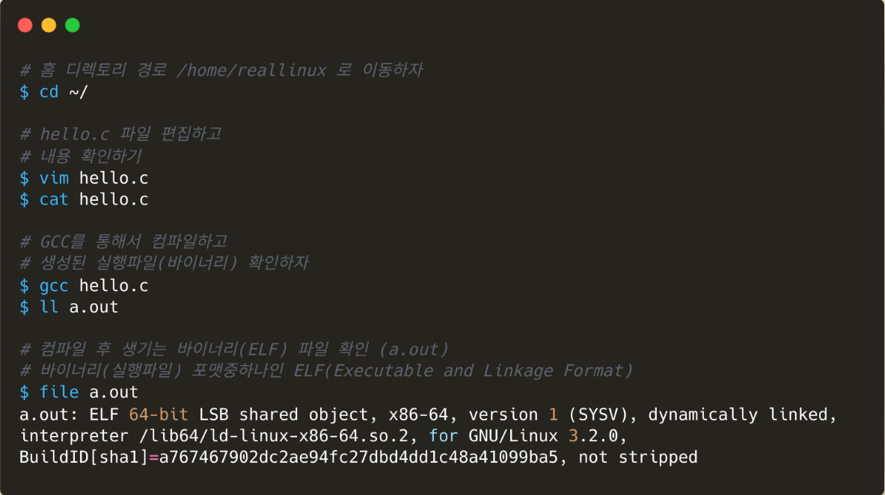
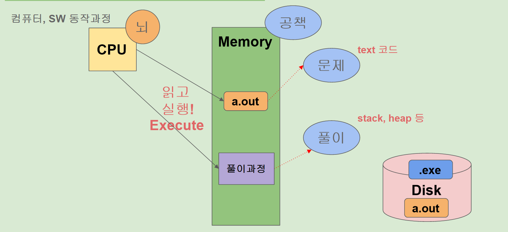

# 리눅스와 일반프로그램(c프로그램) 비교

## 실습 : 리눅스도 c 프로그램과 같은 하나의 c언어 프로그램(vmlinux) 임을 확인하자



### 실제 리눅스에서 확인해보기



```bash
$ echo $$
1164

# 현재 프로세스 PID 1164 기준으로
# 가상메모리 주소공간을 어떻게 나눠서 쓰고 사용중인지 파악가능
$ cat /proc/1164/maps
55c54eb8a000-55c54ec8e000 r-xp 00000000 08:02 131100                     /bin/bash
55c54ee8d000-55c54ee91000 r--p 00103000 08:02 131100                     /bin/bash
55c54ee91000-55c54ee9a000 rw-p 00107000 08:02 131100                     /bin/bash
55c54ee9a000-55c54eea4000 rw-p 00000000 00:00 0
55c54f48d000-55c54f60f000 rw-p 00000000 00:00 0                          [heap]
...
7fff9f2e2000-7fff9f303000 rw-p 00000000 00:00 0                          [stack]

# 지금 실행하는 cat 프로세스 기준으로: self (현재 실행중인 프로세스 PID 대신사용)
# 가상메모리 주소공간을 어떻게 나눠서 쓰고 사용중인지 파악가능
$ cat /proc/self/maps
```

## cpu는 끊임없이 함수를 실행한다.(백지위에서 그려낼 만큼 이해도를 가져야 함) 이런 흐름을 가지고 있어야 문제 해결할 때 편하다.

```
1. 유저 함수 (예 : mysql)

2. 라이브러리 함수 (예 : libc)

****커널 함수는 언제 왜 호출이 될까?** (이론으로 공부한 사람은 잘 대답 못함)**
3. 커널 함수
Entry(부팅 이후에 갑자기 호출되는 경우)  
	1) 예외처리 : 시스템 콜 (why 유저 프로그램이 hw 자원이 필요할 때), 페이지 폴트 등
	2) 인터럽트 : 네트워크 패킷 도착 , usb 연결 , ssd 디스크 I/O 끝난 상황, ...
	
	3) 커널태스크(커널스레드) : ksoftirqd, kworker, ... (후반부 작업)
	
라이브러리 함수와 유저함수가 cpu 점유율이 이상적으로 높다.
커널 함수는 서포트 해줌 
```