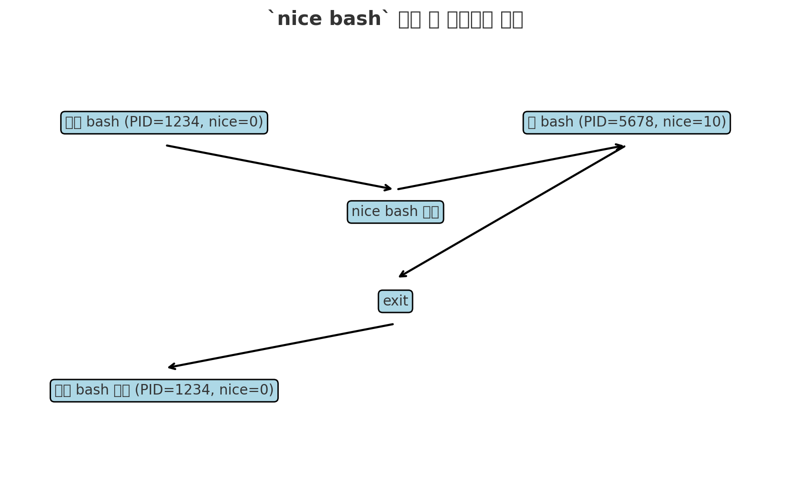

# 우선 순위와 nice 값의 이해

# nice 값 : 얼마나 친절 하게 CPU를 양보를 하는가?

## 1. nice 값과 실제 우선순위 관계

리눅스에서는 nice 값 자체가 CPU 스케줄러의 "정책 입력값"이고, 실제 내부 우선순위는 **PR (Priority)** 라는 값으로 계산됩니다.

```
PR = 20 + nice
```

- nice 0 → PR 20 (기본)
- nice 10 → PR 30 (낮은 우선순위 → CPU 적게 받음)
- nice -5 → PR 15 (높은 우선순위 → CPU 많이 받음)

💡 **PR 값이 낮을수록** CPU 스케줄러가 먼저 실행시킵니다.

---

## 2. 바뀌면 생기는 변화

| nice 값 | PR 값 | CPU 점유 경향 | 예시 상황 |
| --- | --- | --- | --- |
| -20 | 0 | CPU 제일 많이 받음 | 실시간 처리, 긴급 연산 |
| 0 | 20 | 기본값 | 일반 프로그램 실행 |
| 10 | 30 | CPU 덜 받음 | 백그라운드 작업, 파일 다운로드 |
| 19 | 39 | 거의 마지막에 CPU 받음 | 낮은 중요도의 배치 작업 |

---

근데 왜 nice 값은 exit을 하면 돌아옴?

### ChatGPT의 말:

그건 **nice 값이 프로세스 단위 설정**이라서 그래요.

---

## 1. 왜 돌아오는가?

- `nice` 값을 변경하면 **그 프로세스**(그리고 그 프로세스가 만든 자식 프로세스)에만 적용됩니다.
- 해당 프로세스가 **종료(exit)** 하면, 새로 실행되는 프로세스는 다시 기본값(nice=0)으로 시작합니다.
- 즉, nice 값은 **영구 설정이 아니라 실행 중인 프로세스의 일시적 속성**이에요.



nice 값은 "프로세스의 속성"이고, 부모에서 바뀐 값은 자식이 물려받지만, 그 프로세스가 끝나면 원래 nice 값인 부모로 돌아오기 때문에 초기화된 것처럼 보인다.

---

`nice` 값은 **리눅스 커널이 CPU 스케줄링을 할 때 참고하는 프로세스의 속성** 중 하나예요.

---

## 1. "프로세스 객체"가 뭔데?

- 리눅스에서 실행 중인 프로그램은 **프로세스(Process)** 로 관리됩니다.
- 커널은 각 프로세스를 **`task_struct`** 라는 구조체(프로세스 제어 블록, PCB)에 저장해요.
- 이 구조체 안에 **PID, 상태, 메모리 정보, 파일 핸들, 스케줄링 정보** 등이 들어 있습니다.
- `nice` 값도 여기 들어있는 필드 중 하나입니다.

---

## 2. 스케줄링 속성이라는 뜻

- CPU는 동시에 하나의 작업만 실행할 수 있으니까, 커널의 **스케줄러**가 순서를 정해 줍니다.
- `nice` 값은 스케줄러에게 **“이 프로세스는 CPU를 더/덜 자주 주세요”** 하는 우선순위 힌트를 주는 값입니다.
- nice 값이 변경되면, 스케줄러가 그 프로세스의 **동적 우선순위(PR)** 를 조정합니다.
    - PR = 20 + nice 값 (값이 낮을수록 우선순위 높음)

---

## 3. 중요한 특징

- **프로세스 단위**이므로, 한 프로세스의 nice 값 변경이 다른 프로세스에는 영향을 주지 않음.
- 자식 프로세스는 부모의 nice 값을 상속받지만, 그 이후에는 각자 독립적으로 가집니다.
- exit 하면 프로세스 자체가 사라지므로, nice 값도 함께 없어짐.

---

📌 **정리**

> "nice 값은 프로세스 객체의 스케줄링 속성"이라는 말은,
> 
> 
> 각 프로세스가 커널에 등록될 때 갖는 **고유한 CPU 우선순위 정보**라는 뜻입니다.
> 
> 커널 스케줄러는 이 값을 보고 CPU 시간을 배분합니다.
> 

```bash
# nice 값 수치확인하는 방법
# /proc/PID/stat 결과의 19번째 값
$ man proc
...
(19) nice  %ld
     The  nice  value  (see setpriority(2)), a value in the  
     range 19 (low priority) to -20 (high priority).
     
# renice 명령어 : 실행중인 프로세스 nice 값 변경하기
$ whatis renice
renice (1)           - alter priority of running processes   

# 현재 프로세스 Bash PID 확인
$ echo $$
4095

# renice 명령어로 nice 값 변경하기
$ renice -n 10 -p $$
4095 (process ID) old priority 0, new priority 10
```

## nice 와 renice 차이점

## 1. 차이 정리

| 명령어 | 언제 적용? | 대상 | 특징 |
| --- | --- | --- | --- |
| **nice** | **프로세스 시작할 때** | 새로 실행할 프로세스 | 명령 실행 시 지정한 nice 값으로 시작 |
| **renice** | **이미 실행 중인 프로세스** | 기존에 돌고 있는 프로세스(PID, 사용자, 그룹) | 실행 중에도 우선순위 변경 가능 |

---

## 2. 예시 비교

### nice

```bash
# 새 bash를 nice=10으로 실행
$ nice -n 10 bash
$ ps -o pid,comm,nice | grep $$
5678 bash   10
```

- 새로 만든 bash에만 nice 값 적용
- 기존 bash는 nice=0 그대로

---

### renice

```bash
# 이미 실행 중인 프로세스의 nice 값 변경
$ renice -n 5 -p 5678
5678 (process ID) old priority 10, new priority 5
```

- 프로세스를 죽이지 않고 nice 값 즉시 변경
- root면 음수 값도 가능 (우선순위 올리기)

---

## 3. 핵심 차이

- **nice**: “시작할 때부터 이 우선순위로 돌려라”
- **renice**: “지금 돌고 있는 놈의 우선순위를 바꿔라”

---