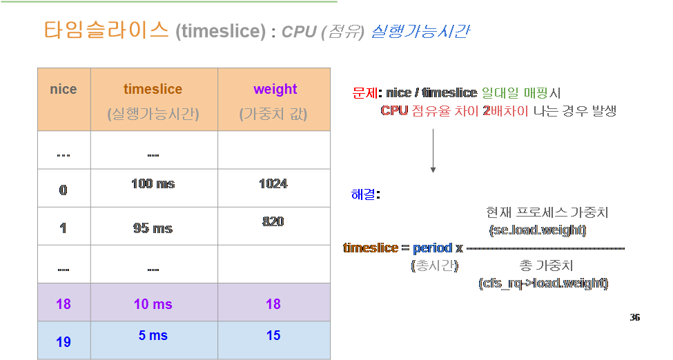
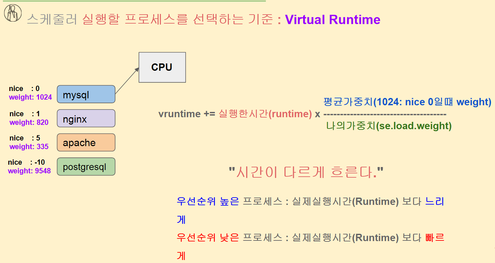
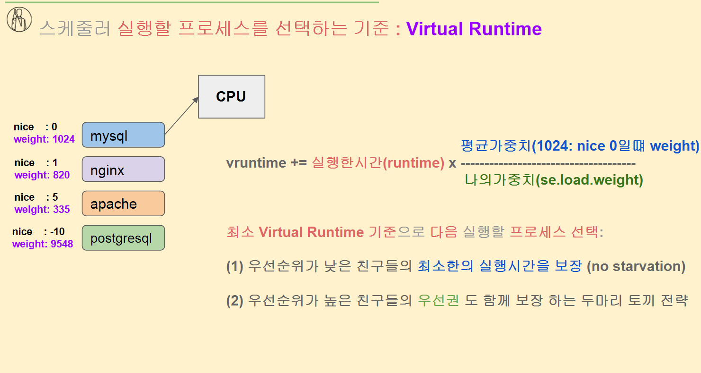
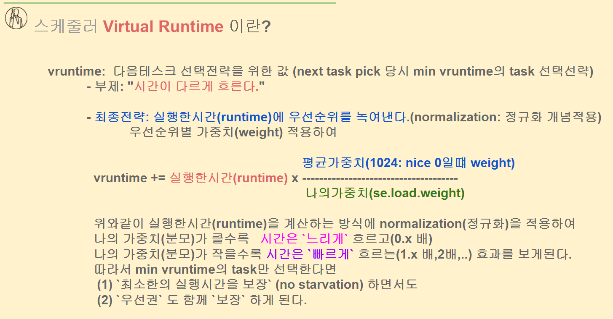

# 타임 슬라이스 할당과 virtul runtime 이해



**CFS(Completely Fair Scheduler)** 에서 타임슬라이스를 계산하는 방식을 보여주고 있네요.

---

## 1. 기존 문제

- 예전 방식: nice 값 ↔ 타임슬라이스를 **고정 매핑**
    - 예: nice=18 → 10ms, nice=19 → 5ms
- 이 방식은 **비슷한 작업인데도 CPU 점유율이 2배 차이** 나는 문제 발생

---

## 2. CFS의 해결 방식

CFS는 타임슬라이스를 "비율"로 계산합니다.

```
timeslice = period × (현재 프로세스 가중치 / 전체 가중치 합)
```

- **period**: CPU 분배 주기 (예: 100ms)
- **현재 프로세스 가중치**: nice 값에 따라 부여된 weight (표의 `weight` 열)
- **전체 가중치 합**: 현재 CPU에서 실행 대기 중인 모든 프로세스 weight 합

---

## 3. weight 값

- nice 0 → weight 1024
- nice 1 → weight 820
- nice 18 → weight 18
- nice 19 → weight 15
- nice 값이 1씩 증가하면 weight는 약 10%씩 감소

---

## 4. 효과

- 고정된 ms로 할당하지 않고, **전체 프로세스의 weight 비율에 맞춰 동적으로 타임슬라이스를 계산**
- CPU 점유율이 정확히 weight 비율에 맞춰 분배되므로, 2배 이상 차이 나는 불합리한 상황이 줄어듭니다.

---

📌 **정리**

> CFS에서는 nice 값 → weight → 타임슬라이스 → CPU 점유율 순으로 계산하며,
> 
> 
> 모든 프로세스가 weight 비율만큼 CPU를 차지하게 설계되어 있습니다.
> 

---

# 스케줄러 Virtual Runtime 란?

전반적인 배경을 이해하고 어떤 효과를 볼 수 있는지 잘 정리가 되어야 한다.






