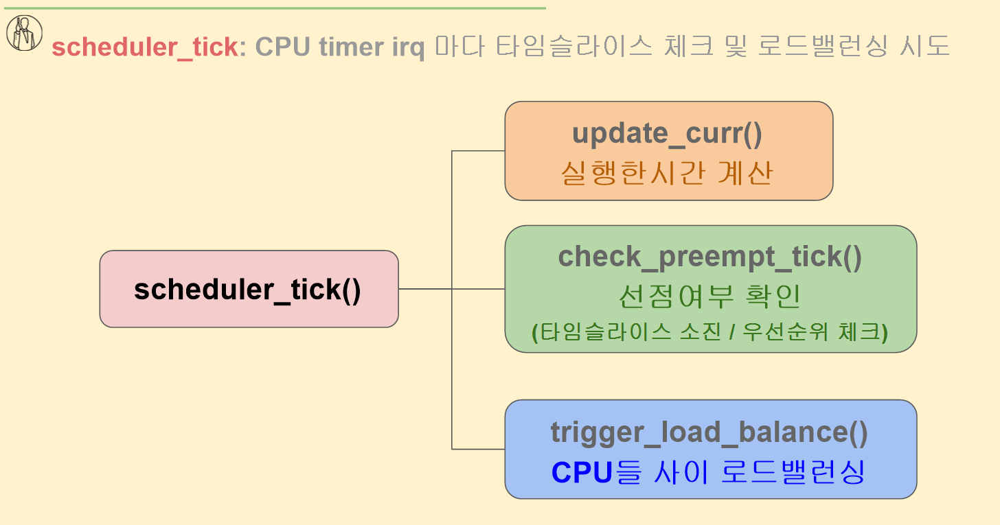

# 스케줄러 구성과 역할

## 리눅스 스케줄러 4요소 쉽게 이해하기

1. **scheduler_tick**
    - ⏱️ CPU에 달린 "알람 시계" 같은 역할.
    - 일정 시간마다(타임슬라이스) CPU가 "너 지금 실행 중인 프로세스 계속 돌려도 되나?" 확인함.
    - 시간이 다 되면 교체할 수도 있고, CPU 간 균형을 맞추려고 **로드밸런싱(LB)**도 시도함.

---

1. **schedule**
    - 🚦 "다음 차례 누구?"를 정하는 심판.
    - 지금 프로세스를 멈추고, **다음에 실행할 프로세스**를 선택.
    - 이 과정에서 **context switch (문맥 교환)**이 발생 → CPU 레지스터, 메모리 상태 등을 바꿔줌.

---

1. **try_to_wake_up (ttwu)**
    - 🛌 자던 애 깨우기.
    - 어떤 프로세스가 **sleep(대기)** 상태였다가, 누군가 신호를 보내면 이 함수가 불려서 **ready 상태**로 바꿔줌.
    - 예: 네트워크에서 데이터가 도착 → 기다리던 프로세스를 깨움.

---

1. **load_balance**
    - ⚖️ CPU들 사이에 일(프로세스)을 고르게 분배.
    - 어떤 CPU가 바쁘고, 다른 CPU가 한가하면 → 일감을 나눠서 전체 속도를 높이는 역할.
    - Timer interrupt 때마다 실행 가능.

---

## scheduler_tick() 흐름

`scheduler_tick()`은 **CPU에 달린 타이머 인터럽트**가 일정 시간마다 울릴 때 실행됩니다.

쉽게 말해, **“야! 시간 체크해!”** 하고 CPU한테 알려주는 함수예요.

이 안에서는 3가지 중요한 일을 합니다:

---

### 1. `update_curr()` — 실행한 시간 계산

- 현재 실행 중인 프로세스가 **얼마나 CPU를 사용했는지** 계산.
- 프로세스마다 사용 시간 누적 → 이후 우선순위/스케줄링에 반영됨.
    
    👉 **비유**: “너 지금까지 5분 발표했어!” 라고 기록하는 역할.
    

---

### 2. `check_preempt_tick()` — 선점 여부 확인

- 지금 실행 중인 프로세스를 계속 돌려야 할지, 중간에 끊고 다른 프로세스로 바꿀지 검사.
- 체크 항목:
    - **타임슬라이스 다 썼는지?**
    - **더 우선순위 높은 애가 기다리는지?**
        
        👉 **비유**: 발표자가 시간 다 됐거나, 더 중요한 사람이 기다리면 마이크 뺏어서 넘겨줌.
        

---

### 3. `trigger_load_balance()` — CPU들 사이 로드밸런싱

- 여러 개의 CPU(Core)가 있을 때, 일이 한쪽에만 몰려 있지 않게 분배 시도.
- “A코어는 바쁜데, B코어는 놀고 있네? → 일 좀 나눠줘야겠다.”
    
    👉 **비유**: 조별 과제에서 A조는 빡세게 하고, B조는 한가하면 → “B조도 좀 도와!” 시키는 것.
    

---

## 📌 schedule() 함수의 역할

`schedule()`은 **CPU가 다음에 어떤 프로세스를 실행할지 정하고, 교체(context switch)하는 함수**예요.

흐름은 이렇게 됩니다:

---

### 1. `pick_next_task()`

- 준비(ready) 상태의 여러 프로세스 중에서 **누가 다음 차례인지 선택**.
- 선택 기준: **최소 vruntime** (가상 실행 시간, virtual runtime)
    - vruntime은 **CPU를 얼마나 공평하게 나눠썼는지**를 나타내는 지표.
    - CPU를 많이 못 쓴 프로세스일수록 vruntime이 작음 → 우선 실행.
        
        👉 **비유**: “줄 서 있는 사람 중, 가장 덜 발표한 사람에게 마이크 주기”
        

---

### 2. `context_switch()`

- 이제 선택된 프로세스에게 **CPU를 넘겨줌**.
- 이전 프로세스의 레지스터, 메모리 상태 저장 → 새 프로세스 상태 불러오기.
    
    👉 **비유**: “지금 발표자가 내려오고, 새 발표자가 단상에 올라가서 이어 발표 시작”
    

---

## try_to_wake_up() (ttwu)

- 역할: **잠자고 있는(sleep) 프로세스를 깨워서 실행 대기열(runqueue)에 올려놓는 것**
    
    👉 즉, "이제 CPU 쓸 준비해!" 하는 단계예요.
    

---

### 1. `activate_task()`

- 깨운 프로세스를 **런큐(runqueue)** 에 넣음.
- 런큐는 "CPU 실행 대기열" 같은 줄서기 공간.
    
    👉 **비유**: “대기표 뽑고 줄에 서라”
    

---

### 2. `ttwu_do_wakeup()`

- 프로세스의 상태를 **TASK_INTERRUPTIBLE / TASK_UNINTERRUPTIBLE → TASK_RUNNING(R)** 으로 바꿈.
- 즉, **실행 가능 상태(Running Ready)** 로 바꿔줌.
    
    👉 **비유**: “이제 자지 말고, 발표 준비해!”
    

---

## 📌 load_balance()

- 역할: **CPU들 사이에 일이 고르게 분배되도록 조정**
- 실행 시점: **Timer IRQ (타이머 인터럽트)**가 발생할 때마다 주기적으로 실행됨.

👉 쉽게 말해:

“어떤 CPU는 일이 너무 많고, 어떤 CPU는 놀고 있으면, 일(태스크)을 옮겨서 공평하게 나눠줌”

---

### 1. `find_busiest_queue()`

- **가장 바쁜 런큐(runqueue)** 찾기.
- 즉, 여러 CPU 중에서 “줄이 제일 긴 CPU”를 고름.
    
    👉 **비유**: 편의점 계산대 줄 중 제일 긴 줄 찾기.
    

---

### 2. `detach_tasks()`

- 그 줄에서 **넘쳐나는 태스크들을 뽑아옴**.
- 일정 기준 이상으로 과부하 걸린 런큐에서 일부 작업을 분리.
    
    👉 **비유**: 줄이 너무 길면, 몇 명 빼서 옆 계산대로 이동 준비.
    

---

### 3. `attach_tasks()`

- **여유 있는 CPU의 런큐에 태스크를 붙여줌**.
- 이렇게 해서 CPU들 간 균형 맞춤.
    
    👉 **비유**: 한가한 계산대에 빼온 손님을 보내서 전체 대기 시간을 줄임.
    

---

## ✅ 정리

- `load_balance()`는 **멀티코어 CPU 환경에서 필수적인 균형 맞춤 메커니즘**.
1. 제일 바쁜 CPU 찾고(`find_busiest_queue`)
2. 거기서 태스크 일부 빼내고(`detach_tasks`)
3. 한가한 CPU에 넣어줌(`attach_tasks`)

