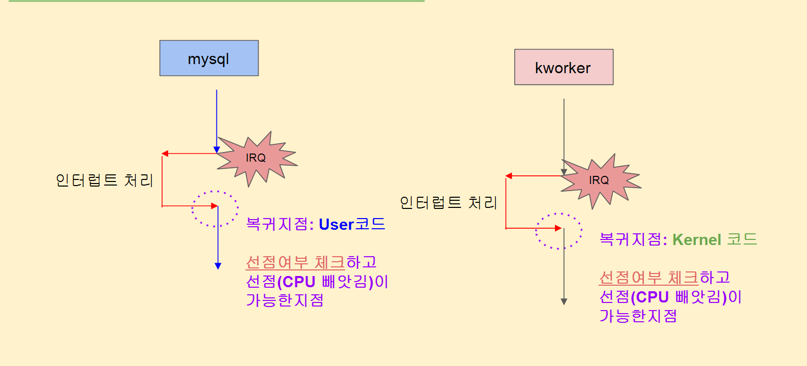
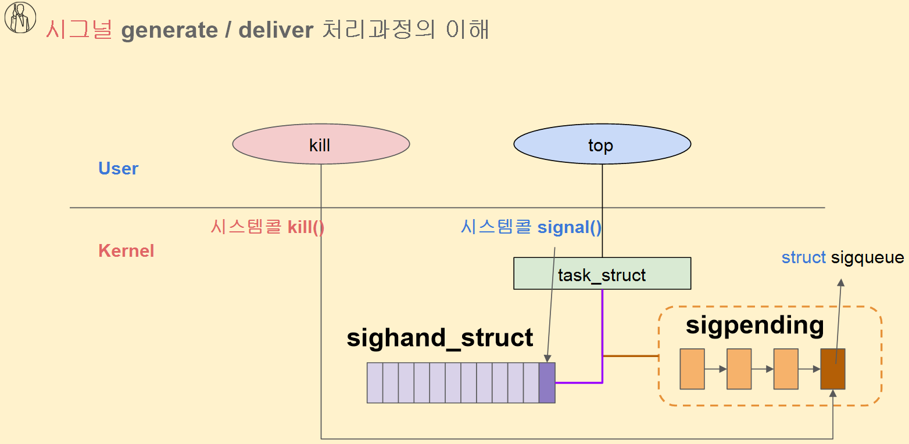
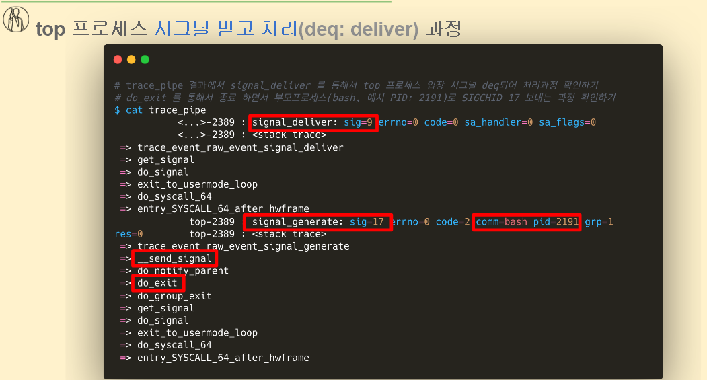

# 선점(preemp)과 시그널 처리 추적

현재 task 입장 : CPU를 빼앗긴다 (선점 당한다.)

cpu를 뺴앗기는 타이밍이 언제 일까?



```
mysql이 cpu를 점유하고 있는데 갑자기 빼앗기지는 않을 것이다.
IRQ 인터럽트 처리 이후 복귀할 때 다른 프로세스로 cpu 점유를 빼앗길 수 있다. (context switch)
인터럽트 처리하는 과정에서  선점 여부를 확인하고 timeslice를 다썼는지, 우선도를 확인하게 된다.
이러한 선점 상황이 발생하더라도 워낙 빨라서 확인은 되지 않는다.

인터럽트 처리가 끝나지 않고 복귀가 안됨 -> 시그널 처리 안됨
복귀 할 때 다른 프로세스로 cpu 뺏김 -> 시그널 처리 안됨

시그널 처리는 interrupt 나 exception 처리가 완료된 이후 복귀 지점에서 일어나는 거임

시그널 -> sigpending queue ->  if 에 handler가 없으면 종료 -> 있으면 user space 에 함수 호출 
```

| 상황 | 시그널 처리 가능 여부 | 이유 |
| --- | --- | --- |
| 인터럽트 핸들러 실행 중 | ❌ 불가능 | 아직 유저모드로 복귀 전 |
| 인터럽트 끝나지 않음 | ❌ 불가능 | 복귀 지점이 아님 |
| 인터럽트 끝났지만 스케줄링 발생 (CPU 뺏김) | ❌ 불가능 | 시그널은 해당 프로세스가 다시 CPU를 얻어 복귀할 때 처리됨 |
| 인터럽트 끝나고 자기 프로세스로 복귀 | ✅ 가능 | `sigpending` 큐 확인 후 `do_signal()`로 처리 |

```bash
# ftrace 초기화 작업하기
$ sudo su
$ cd /sys/kernel/debug/tracing/
$ echo nop > current_tracer 
$ echo 0 > options/stacktrace 
$ echo 0 > events/enable 
$ echo > trace

# 시그널 처리 이벤트 tracing 하기
$ echo 1 > events/signal/enable
$ echo 1 > options/stacktrace

# top 프로세스 PID 값으로 필터링 하기
$ echo "pid" > set_event_pid
$ echo > trace
$ cat trace_pipe

```



```bash
# trace_pipe 결과에서 signal_deliver 를 통해서 top 프로세스 입장 시그널 deq되어 처리과정 확인하기
# do_exit 를 통해서 종료 하면서 부모프로세스(bash, 예시 PID: 2191)로 SIGCHID 17 보내는 과정 확인하기
$ cat trace_pipe 
           <...>-2389 : signal_deliver: sig=9 errno=0 code=0 sa_handler=0 sa_flags=0
           <...>-2389 : <stack trace>
 => trace_event_raw_event_signal_deliver
 => get_signal
 => do_signal
 => exit_to_usermode_loop
 => do_syscall_64
 => entry_SYSCALL_64_after_hwframe
             top-2389 : signal_generate: sig=17 errno=0 code=2 comm=bash pid=2191 grp=1 res=0
             top-2389 : <stack trace>
 => trace_event_raw_event_signal_generate
 => __send_signal
 => do_notify_parent
 => do_exit
 => do_group_exit
 => get_signal
 => do_signal
 => exit_to_usermode_loop
 => do_syscall_64
 => entry_SYSCALL_64_after_hwframe

```

