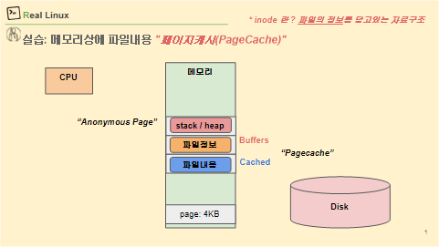

# 시스템 메모리 상태 파악 실습 및 이


`free -h`의 **buff/cache**는 “지금 앱이 쓰는 메모리”가 아니라,

**디스크를 빠르게 쓰려고 커널이 잠깐 잡고 있는 캐시**야.

→ 필요하면 **바로 비워서 앱에 내줄 수 있음**.

# 뭐가 들어있는데?

- **Buffers**: 디스크 쓰기/읽기용 **메타데이터 버퍼**(블록 I/O).
    - **Buffers 는 파일 정보 (inode block 등)**
- **Cached**: 파일 **내용**을 담는 **페이지 캐시**.
    - **Cached 는 파일 내용 (data block)**
    



---

# 의미

- `echo 1 > ...drop_caches` → **페이지 캐시(Page cache)**만 비움 → `free -h`의 **Cached**가 줄어듦.
- `echo 2 > ...drop_caches` → **dentry/inode 캐시(슬랩의 회수 가능분)**만 비움 → **SReclaimable**(슬랩)이 주로 줄어듦.
- `echo 3 > ...drop_caches` → 위 둘 **모두** 비움.

> ※ 앱이 쓰는 실제 메모리는 안 건드려. 캐시만 정리하고, 곧 다시 채워짐.
> 

---

- **inode 블록**: 파일의 **설명서**. 권한/소유자/크기/시간값 + **데이터가 어디에 있는지(포인터·extent)** 정보를 가짐. *파일 이름은 없음!*
- **data 블록**: 파일의 **진짜 내용(바이트)** 이 들어있는 블록. 디렉터리라면 “이름 ↔ inode번호” 목록이 여기에 저장됨.

---

# 그림으로

```
[디렉터리의 data 블록]  ──(이름→inode번호)──▶ [inode 블록] ──(포인터/extent)──▶ [파일의 data 블록들]
           "foo" ──▶ 12345                     inode 12345                         실제 바이트 데이터

```

# 현장 확인 명령

```bash
ls -li file.txt        # inode 번호 보기 (이름은 디렉터리 data블록에, 속성은 inode에)
stat file.txt          # inode, 블록 수, 시간값 등 메타데이터
df -h ; df -i          # 용량(데이터 블록)과 inode 소모 각각 확인

```

---

# 1) `Buffers · Cached · inode/dentry cache` 차이

- **Buffers**
    - 의미: **블록장치 I/O용 “원본 블록 버퍼”**(raw block).
    - 내용물: 데이터 블록, 디렉터리 블록, **inode 블록(원본)** 등 “디스크 블록 그 자체”.
    - `free -h`: **Buffers** 항목.
    - drop_caches 영향: **직접 대상 아님**(보통 `sync`로 쓰기 동기화 후 커널이 줄임).
- **Cached (Page Cache)**
    - 의미: **파일 “내용”**(page) 캐시.
    - 예: `cat big.txt`로 읽은 파일 내용.
    - `free -h`: **Cached** 항목.
    - drop_caches 영향: `echo 1` 또는 `echo 3`에 의해 **줄어듦**.
- **inode/dentry cache (Slab)**
    - 의미: **inode 블록을 해석한 결과 구조체**(파일 메타데이터, 경로명↔inode 매핑).
    - `free -h`: **Slab → SReclaimable**에 포함.
    - drop_caches 영향: `echo 2` 또는 `echo 3`에 의해 **줄어듦**.

> 착각 방지:
> 
> 
> Buffers 안에 *inode 블록의 “원본”*이 있을 수는 있지만, 그건 **inode 캐시**가 아님.
> 
> **inode 캐시 = Slab(SReclaimable)**, **Buffers ≠ inode 캐시**.
> 

---

# 2) `inode` vs `inode 블록` (개념 vs 저장단위)

- **inode**
    - 정체: **파일 하나의 메타데이터**(크기, 권한, 소유자, 데이터블록 포인터…).
    - 메모리에서: 커널의 `struct inode`(= **inode 캐시**, Slab).
- **inode 블록(inode block)**
    - 정체: **디스크에 inode들이 모여 저장**되는 블록(= inode 테이블을 이루는 블록들).
    - 원본 데이터를 메모리로 읽어올 때는 **Buffers**에 올라옴(원본 블록 형태).

> 관계(흐름)
> 
> 
> 디스크의 **inode 블록(원본)** → (메모리 **Buffers**로 읽음) → 커널이 해석 → **struct inode (Slab/SReclaimable)**
> 

---

# 3) 한 눈에 보는 그림

```
[디스크]
 ├─ 데이터 블록 ──▶ (메모리) Page Cache = Cached
 ├─ inode 블록 ───▶ (메모리) Buffers ──(해석)──▶ inode cache = Slab(SReclaimable)
 └─ 디렉터리 블록 ─▶ (메모리) Buffers ──(해석)──▶ dentry cache = Slab(SReclaimable)

```

---

# 4) drop_caches 요약

- `echo 1 > /proc/sys/vm/drop_caches` → **Page Cache(Cached)** 제거
- `echo 2 > /proc/sys/vm/drop_caches` → **inode/dentry(Slab/SReclaimable)** 제거
- `echo 3 > /proc/sys/vm/drop_caches` → 둘 다 제거
- **Buffers**는 대상 아님 → 보통 `sync` 후 커널이 줄임

---

# 5) 외워둘 한 줄 공식

- **Buffers** = 디스크 **블록 원본 버퍼**
- **Cached** = 파일 **내용(page)** 캐시
- **Slab(SReclaimable)** = **inode/dentry(해석된 메타데이터)** 캐시
- **inode 블록**(디스크 저장소) → 해석하면 **inode**(메모리 구조체)

---
