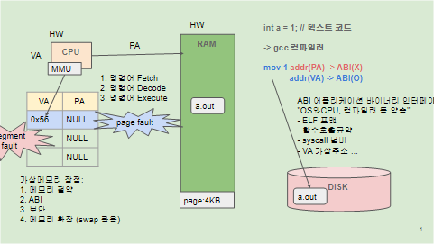

# 가상메모리의 이해

# 1) 용어 한 줄 정의

- **a.out**: gcc/ld가 만든 **ELF 실행 파일**(코드·데이터 담긴 파일).
- **VA (Virtual Address)**: **프로그램이 보는 주소**. 코드/데이터/스택/힙이 놓이는 공간.
- **PA (Physical Address)**: **RAM의 실제 주소**.
- **MMU**: CPU 안의 **주소 변환기**. VA → PA로 바꿔 줌.
- **Page(4KB)**: VA·PA를 나누는 **기본 단위 블록**.
- **Page Fault**: 해당 VA 페이지가 아직 RAM(=PA)에 **안 올라와** 있을 때 나는 **예외**.
- **RAM**: 실제 메모리. 필요한 **page**가 여기로 “불러와짐”.
- **DISK**: a.out이 저장된 곳. 필요할 때 **page 단위로 RAM으로 로드**됨.
- **swap**: RAM이 모자랄 때 **일시 보관**하는 디스크 공간.
- **ABI**: VA 세계에서의 **바이너리 규칙**(호출 규약, 포인터 크기, ELF/재배치 등).
    
    → **VA와 관련(O)**, **PA와는 무관(X)**.
    

# 2) 실행 흐름(그림 왼→오른쪽)

1. **컴파일/링크**
    
    `int a = 1;` → gcc/ld → **a.out(ELF)** 생성.
    
    (.text = 코드, .data = `a=1` 같은 초기 데이터)
    
2. **exec 시작**
    
    `./a.out` → 커널이 **프로세스 VA 공간**을 만들고,
    
    a.out의 `.text/.data` 등을 **VA에 “매핑만” 걸어 둠**.
    
    (아직 **PA 없음**, 페이지 테이블에 **Present=0** 느낌)
    
3. **첫 접근 → Page Fault**
    
    CPU가 **VA**로 코드/데이터를 읽으려 함 → **MMU**가 VA→PA 변환 시도 →
    
    해당 **VA 페이지의 PA가 NULL(미할당)** 이므로 **Page Fault** 발생.
    
4. **페이지 로드**
    
    커널이 **DISK의 a.out**에서 필요한 **page(4KB)** 를 읽어 **RAM**에 올림 →
    
    그 RAM 위치(= **PA**)로 **페이지 테이블**을 채움(권한: `.text`는 R-X, `.data`는 R-W).
    
5. **재실행**
    
    같은 **VA**로 다시 접근 → 이번엔 **MMU가 VA→PA 변환 성공** → 정상 실행.
    
    (이후 자주 쓰면 TLB/캐시 덕에 더 빨라짐)
    
6. **추가 동작**
    - 잘못된 VA 접근이면 **SIGSEGV**.
    - RAM 부족하면 덜 쓰는 페이지가 **swap**으로 나갔다가, 접근 시 다시 **page fault → swap-in**.

# 3) 그림의 문장 해석

- `mov 1 addr(PA) -> ABI(X)` : **PA 직접 접근**은 사용자 코드/ABI 영역 아님.
- `VA -> ABI(O)` : **ABI는 VA 세계의 규칙**(호출 규약·포인터·ELF/재배치)을 정의.

# 4) 5줄로 끝내는 암기 포인트

- 프로그램은 **항상 VA**를 쓴다.
- **MMU**가 VA→PA로 바꾼다.
- 없는 페이지면 **Page Fault** → **DISK의 a.out**에서 **page(4KB)** 를 **RAM**으로.
- `.text`는 **R-X**, `.data`는 **R-W**로 매핑.
- **ABI는 VA 쪽 규칙**, **PA는 커널/하드웨어 몫**.



## 세그멘테이션 폴트(SEGFAULT)란?

프로그램이 **자기 것이 아닌 메모리**를 건드리면, 운영체제가

“거기 들어가면 안 돼!” 하고 프로그램을 **즉시 종료**시키는 거예요.

## 언제 터지냐? (3가지 상황)

1. **없는 곳에 손대기**
    - `NULL` 포인터 사용, 해제(free)한 포인터 재사용, 배열 범위 밖 접근
2. **방법이 잘못됨**
    - 읽기 전용 영역에 **쓰기**, 실행 금지 영역을 **실행**
3. **스택 터짐**
    - 재귀 무한 등으로 **스택 오버플로**
    

```
page table 에다가 적어 놓음 (만약 오래 쓰지 page를 swap 에 빼놓았다고) -> 이러면 나중에 접근 하려고 할 때 error 발생 x -> swap에서 가져오면 문제 없음

MMU가 좀 더 변환과정을 좀 더 빠르게 하기 위해서 TLB(translation lookaside buffer)에 가상주소대비 물리주소에 대한 변환 정보를 일부 저장하게 된다. -> 변환과정 더 빠르게 가능

1️⃣ CPU → 가상 주소 발생
2️⃣ MMU가 TLB에서 해당 가상 주소의 매핑 정보 검색
    ↳ 있으면 (TLB hit): 바로 물리 주소로 변환 → 빠름
    ↳ 없으면 (TLB miss): 페이지 테이블 참조 후 변환 → 느림
3️⃣ 변환 결과를 다시 TLB에 저장 (LRU 등 정책 사용)
```