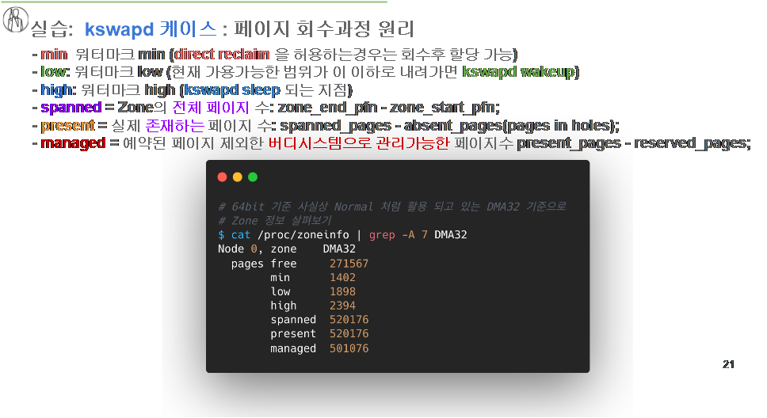
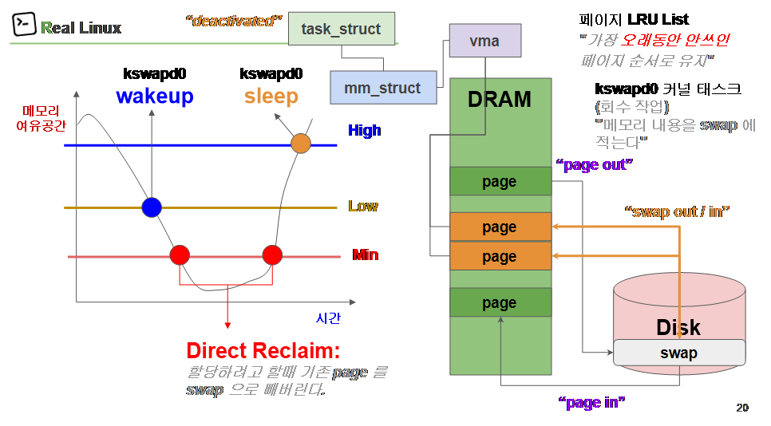

# 페이지 회수이해와 추적: Page-In/Out와 Swap-In/Out


```
page = 4KB = 4096 = 0x1000
```

# 개념

- **DRAM**: 실제 메모리. **page** 단위로 관리됨.
- **메모리 여유공간**: 지금 남아 있는 가용 메모리량(왼쪽 그래프의 세로축).
- **High / Low / Min**: 메모리 수위(워터마크) 3단계 기준선.
- **kswapd running**: 커널이 백그라운드에서 메모리 정리 중인 상태.
- **wakeup / sleep**: kswapd가 깨어남/잠드는 시점.
- **page-out**: DRAM의 **page**를 디스크로 내보내는 동작.
- **Disk – swap**: 디스크의 **swap** 영역(페이지 임시 보관소).
- **swap-out**: 부족한 메모리를 확보하기 위해 대량으로 page-out 하는 과정.

# 시간 흐름(오른쪽 → 왼쪽 그래프 연결)

1. 여유공간이 **High** 이상 → kswapd는 **sleep**.
2. 시간이 지나 여유공간이 **Low** 아래로 떨어짐 → kswapd **wakeup**.
3. **kswapd running** 동안 DRAM의 찬 **page**들을 골라 **page-out** → **Disk**의 **swap**으로 보냄(= **swap-out** 진행).
4. 여유공간이 다시 **High** 위로 회복되면 → kswapd **sleep**.
5. 만약 여유공간이 **Min** 아래까지 내려가면 → 더 공격적으로 **swap-out**이 일어나 성능 저하가 커짐.

# 한 줄 요약

메모리 여유공간이 **Low** 밑으로 떨어지면 kswapd가 **wakeup**되어 DRAM의 **page**를 **page-out**(= **swap-out**) 해 여유공간을 **High** 근처까지 끌어올리고, 회복되면 **sleep**한다.





---

## 커널 관점에서 왜 swap이 생기나

1. 프로세스가 2 GiB에 달하는 **anonymous page**들을 계속 만들고, 각 페이지에 **실제로 쓰기**가 발생.
2. 시스템의 **메모리 여유공간**이 `Low` 이하로 내려가면 **kswapd가 wakeup**.
3. LRU에서 오래 안 쓴 페이지를 골라 **page-out** → **Disk의 swap**으로 기록(**swap-out**).
    - 파일 캐시는 “드롭”하면 끝이지만, 이 바이트들은 **파일 백업이 없는 익명 페이지**라서 **반드시 swap**에 써야 함.
4. 여유공간이 `High`로 회복되면 kswapd **sleep**.
    
    여유가 더 줄어 `Min` 근처면 **direct reclaim**으로 요청 스레드가 잠깐 멈칫할 수 있음.
    
5. 나중에 접근되면 **page-in / swap-in**으로 다시 DRAM으로 올라옴.
6. **swap이 없거나 부족**하면 → **OOM killer**가 이 파이썬 프로세스를 종료할 수 있음.

```bash
 # 파이썬 numpy 라이브러리 설치
$ sudo apt-get install python-pip
$ sudo pip install numpy

# swap 유도하는 파이썬 스크립트 실행하기
$ vim swap_test.py
$ cat swap_test.py

#!/usr/bin/python2
import numpy

result = [numpy.random.bytes(1024*1024*2) for x in xrange(1024)]  
print len(result)

# swap 유도 테스트 하기
$ python swap_test.py

# htop 통해서 메모리 공간과 swap 공간
$ sudo apt install -y htop
$ htop

# 커널 함수 kswapd0 추적하기
$ sudo su
$ cd /sys/kernel/debug/tracing/
$ echo 1 > events/vmscan/enable
$ cat trace_pipe

# 컨트롤+c 키로 종료하고 커널 추적 종료
$ echo 0 > events/enable
$ exit
```

---