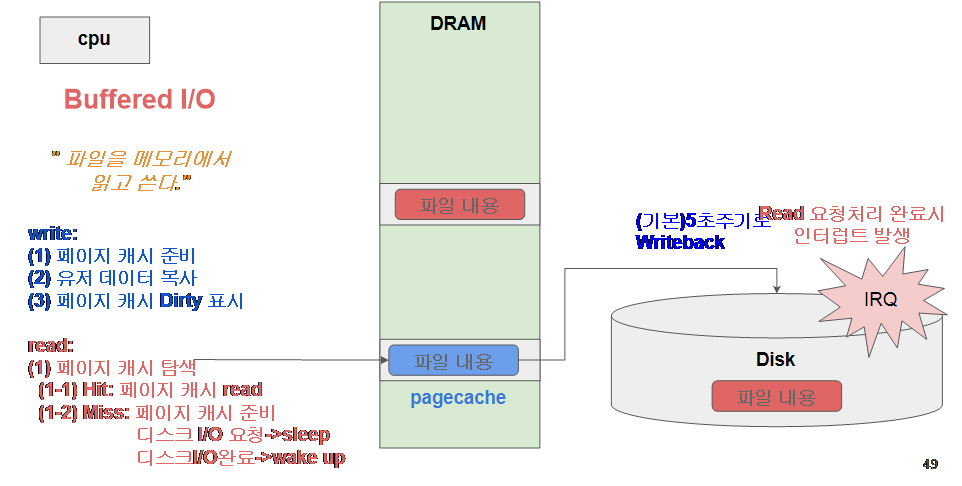

# 리눅스 파일 Read/Write

buffer 는  file 의 meta 데이터 (inode block 등)

cache 는 file의 데이터 캐시, 디스크 캐시(data block)

## Buffered I/O의 본질

- **Buffered I/O = Page Cache를 활용한 파일 I/O**
    
    → 애플리케이션이 `read`/`write` 같은 일반적인 I/O 호출을 할 때, 실제 디스크에 바로 접근하지 않고 커널의 **페이지 캐시**를 통해 이루어집니다.
    
- 그래서 일반적으로 말하는 "Buffered I/O"는 **리눅스 파일 I/O의 기본 모드**예요.

---

## Write 과정

1. **페이지 캐시 공간 확보**
    - 파일을 매핑할 메모리 페이지가 없으면 새로 할당합니다.
2. **사용자 공간 → 커널 공간 복사**
    - 애플리케이션이 쓴 데이터를 페이지 캐시에 올립니다.
3. **Dirty Page 표시**
    - 이 메모리가 **디스크와 불일치(Dirty)** 상태임을 표시. 메모리와 디스크의 데이터가 다름 → Dirty Page
4. **지연 기록 (Lazy Write)**
    - 실제 디스크 쓰기는 지연됩니다.
    - 커널의 **pdflush/kworker** 프로세스가 주기적으로(기본 5초 단위) Dirty Page를 디스크에 flush(writeback)합니다.
    - 또는 `fsync()`, `sync` 같은 명령이 호출되면 즉시 디스크에 반영합니다.

👉 따라서 애플리케이션은 쓰기 호출을 하자마자 빠른 속도로 끝나지만, 실제 디스크 반영은 **나중에** 일어나죠.

---

## Read(읽기) 과정

1. **페이지 캐시 탐색**
    - (1-1) **Hit** → 이미 메모리에 있으면 바로 읽음 (빠름)
    - (1-2) **Miss** → 메모리에 없으면 Disk에서 읽어옴 (느림)
        - 이때 CPU는 Disk I/O 요청을 보내고 **sleep** 상태가 됨
        - Disk에서 데이터가 다 올라오면 **IRQ(인터럽트)**로 CPU를 깨워서 다시 작업 진행

---

## 정리

- **장점**: 속도가 빠름 (Disk 직접 접근보다 훨씬 빠른 DRAM 이용)
- **단점**: 데이터가 메모리에만 있고 아직 Disk에 쓰지 않았다면, 갑자기 전원이 꺼지면 날아갈 수 있음 → 그래서 **Writeback 정책**이 중요

---

## 1. 구조 이해

- **User space (사용자 공간)**
    
    → 우리가 실행하는 프로그램(예: cat, vim, DB)이 여기에 있음.
    
    → 프로그램이 파일을 읽고 싶으면, C 라이브러리 함수를 통해 **시스템콜**을 호출.
    
- **Kernel space (커널 공간)**
    - **System call Interface**: `read()` 같은 시스템 콜을 처리하는 입구
    - **VFS (Virtual File System)**: 다양한 파일 시스템(ext4, xfs 등)을 통일된 인터페이스로 다룸
    - **FS (File System)**: 실제 파일 시스템 코드
    - **Block layer & Device driver**: 디스크 장치까지 내려가는 계층

---

## 2. Buffered I/O 동작 (캐시 Hit vs Miss)

### (1) **캐시 Hit** (첫 번째 그림)

- 프로그램이 파일을 읽으려 함 → 시스템콜로 커널 진입
- 커널이 `pagecache_get_page`를 통해 **페이지 캐시(pagecache)** 확인
- **이미 메모리에 데이터 있음 (Hit)**
    
    → 곧바로 DRAM에서 읽어서 응답
    
- **속도: 매우 빠름 (디스크 접근 안 함)**

---

### (2) **캐시 Miss** (두 번째 그림)

- 프로그램이 파일을 읽으려 함 → 시스템콜로 커널 진입
- 커널이 `pagecache_get_page` 확인했는데, **메모리에 데이터 없음 (Miss)**
- → 디스크에서 블록 단위로 읽어와서 메모리에 적재
- 이후 이 데이터를 페이지 캐시에 저장 → 사용자에게 전달
- **속도: 느림 (디스크 접근 필요)**

---

## 3. 핵심 포인트

- **Buffered I/O의 목표**: 디스크를 직접 접근하지 않고, **가능하면 메모리 캐시에서 처리**
- **Hit**: 빠른 읽기 (RAM에서 바로 가져옴)
- **Miss**: 디스크 접근 필요 (느림, 대신 캐시에 저장해서 다음엔 빠름)
- **Access Time 변화**: Hit → ns 수준, Miss → ms 수준 (차이 수십만 배)

---

✅ 한 줄 요약:

Buffered I/O에서 **read 과정**은

1. 먼저 **페이지 캐시(pagecache)**를 확인한다.
2. **Hit**면 메모리에서 바로 반환,
3. **Miss**면 디스크에서 읽어와 캐시에 넣고 반환한다.

## 📌 User space (사용자 공간)

- 우리가 실행하는 프로그램이 돌아가는 공간
- 예: `cat file.txt`, `vim test.c`, DB, 웹서버 등
- 이 공간의 프로그램이 파일을 읽으려면 `read()` 같은 **시스템콜**을 사용해서 커널에 요청을 보냄

---

## 📌 GNU C Library (glibc)

- 리눅스에서 제공하는 표준 C 라이브러리
- 우리가 `fopen()`, `read()` 같은 함수를 쓰면, 사실 glibc가 이를 받아 **시스템콜로 변환**해서 커널에 전달

---

## 📌 Kernel space (커널 공간)

- 운영체제의 핵심 코드가 실행되는 공간
- User space에서 직접 접근 불가능 → 반드시 **시스템콜**을 통해 접근

---

## 📌 System call Interface

- 사용자 프로그램이 커널 기능(파일 읽기/쓰기, 네트워크 등)을 요청하는 **입구**
- 예: `read()`, `write()`, `open()`

---

## 📌 VFS (Virtual File System, 가상 파일 시스템)

- ext4, xfs, nfs 등 파일시스템을 추상화한 **공통 인터페이스**
- 프로그램 입장에서는 어떤 파일시스템인지 몰라도, 동일한 방식으로 접근 가능

---

## 📌 FS (File System)

- 실제 파일시스템 구현부 (ext4, xfs 등)
- VFS를 통해 들어온 요청을 실제 디스크 블록 단위 작업으로 변환

---

## 📌 Block Layer

- 파일시스템 요청을 **블록 단위 I/O**로 바꿔주는 계층
- 파일 단위가 아닌, 디스크가 다루는 물리적 블록 단위(예: 4KB)로 변환

---

## 📌 Device Drivers

- 특정 하드웨어 장치(HDD, SSD 등)를 제어하는 코드
- Block Layer에서 내려온 요청을 실제 하드웨어 명령으로 변환

---

## 📌 Buffered I/O

- "디스크에 직접 읽고 쓰지 않고, **메모리(RAM)에 있는 페이지 캐시를 먼저 거치는 방식**"
- **장점**: 빠름 (RAM 접근)
- **단점**: 전원 꺼지면 메모리에 있는 데이터는 날아감

---

## 📌 Page Cache (페이지 캐시)

- 파일 내용을 미리 **메모리(DRAM)에 저장**해 두는 영역
- 파일 읽을 때: 캐시에 있으면 빠름 (Hit), 없으면 디스크에서 읽어옴 (Miss)
- 파일 쓸 때: 먼저 캐시에 기록하고, 나중에 디스크에 반영 (Writeback)

---

## 📌 pagecache_get_page

- 커널 함수 중 하나
- “이 파일 내용이 캐시에 있는지 확인해라” 라는 동작을 수행

---

## 📌 Hit vs Miss

- **Hit**: 캐시에 이미 데이터가 있음 → 곧바로 반환 (빠름)
- **Miss**: 캐시에 없음 → 디스크에서 읽어와 캐시에 넣고 반환 (느림)

---

## 📌 Access Time

- 데이터 접근 속도
- RAM(나노초 ns) vs 디스크(밀리초 ms) → **수십만 배 차이**

---

## 📌 Read Pages

- 디스크에서 직접 블록을 읽어와 메모리에 적재하는 과정

---