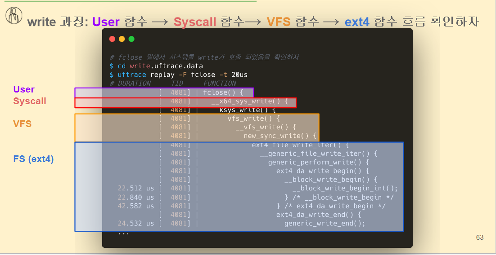
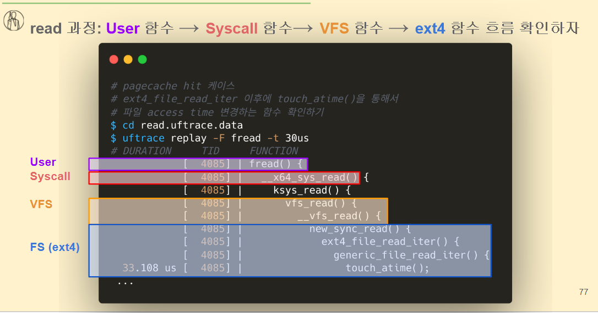
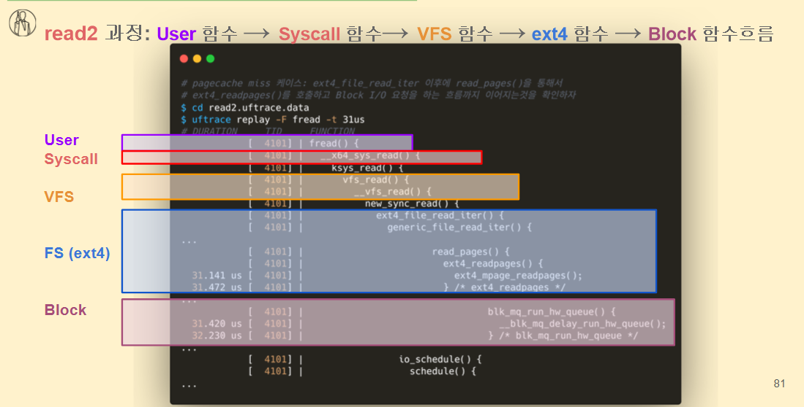

# 리눅스 파일 Read/Write

buffer 는  file 의 meta 데이터 (inode block 등)

cache 는 file의 데이터 캐시, 디스크 캐시(data block)

```
bloack layer로 바로 이어지는게 아니라 
메모리에다가 I/o를 구동시키는 것을 기본으로 나중에 디스크에 반영하는 방식으로 하게 된다.

used 보다 buff/cache 가 더 높은 확률이 높다 -> 웹서버 프로그램, db 프로그램 같은 파일 프로그램을 다룰 확률이 높다. 파일 내용을 메모리에 유지시켜서 가는 경우가 많다. 

익명 페이지는 프로세스가 메모리만 요청했지 디스크 파일이 없음 → “anonymous”라고 부름.
Anonymous page
: 디스크 파일과 연결되지 않은, 프로세스의 힙/스택/전역변수 등 “순수 메모리 기반” 데이터가 저장된 페이지.
malloc, stack, heap에서 사용되며, swap으로만 복원 가능.
반면 buff/cache는 파일 데이터를 캐싱한 file-backed page로, 웹서버나 DB에서 많이 증가함.

Page Cache란?

Page Cache는 커널이 디스크 파일의 내용을 메모리에 캐싱해 두는 영역이야.
즉, 한 번 읽었던 파일 데이터를 메모리에 저장해 두었다가,
다음에 같은 파일을 접근할 때 디스크를 다시 읽지 않고 메모리에서 즉시 제공하는 구조야.
```

## Buffered I/O의 본질 (무조건 memory 에서 읽고 쓰게 된다.)

- **Buffered I/O = Page Cache를 활용한 파일 I/O**
    
    → 애플리케이션이 `read`/`write` 같은 일반적인 I/O 호출을 할 때, 실제 디스크에 바로 접근하지 않고 커널의 **페이지 캐시**를 통해 이루어집니다.
    
- 그래서 일반적으로 말하는 "Buffered I/O"는 **리눅스 파일 I/O의 기본 모드**예요.

---

## Write 과정

1. **페이지 캐시 공간 확보**
    - 파일을 매핑할 메모리 페이지가 없으면 새로 할당합니다.
2. **사용자 공간 → 커널 공간 복사**
    - 애플리케이션이 쓴 데이터를 페이지 캐시에 올립니다.
3. **Dirty Page 표시**
    - 이 메모리가 **디스크와 불일치(Dirty)** 상태임을 표시. 메모리와 디스크의 데이터가 다름 → Dirty Page
4. **지연 기록 (Lazy Write)**
    - 실제 디스크 쓰기는 지연됩니다.
    - 커널의 **pdflush/kworker** 프로세스가 주기적으로(기본 5초 단위) Dirty Page를 디스크에 flush(writeback)합니다.
    - 또는 `fsync()`, `sync` 같은 명령이 호출되면 즉시 디스크에 반영합니다.

👉 따라서 애플리케이션은 쓰기 호출을 하자마자 빠른 속도로 끝나지만, 실제 디스크 반영은 **나중에** 일어나죠.

---

## Read(읽기) 과정

1. **페이지 캐시 탐색**
    - (1-1) **Hit** → 이미 메모리에 있으면 바로 읽음 (빠름)
    - (1-2) **Miss** → 메모리에 없으면 Disk에서 읽어옴 (느림)
        - 이때 CPU는 Disk I/O 요청을 보내고 **sleep** 상태가 됨
        - Disk에서 데이터가 다 올라오면 **IRQ(인터럽트)**로 CPU를 깨워서 다시 작업 진행

---

## 정리

- **장점**: 속도가 빠름 (Disk 직접 접근보다 훨씬 빠른 DRAM 이용)
- **단점**: 데이터가 메모리에만 있고 아직 Disk에 쓰지 않았다면, 갑자기 전원이 꺼지면 날아갈 수 있음 → 그래서 **Writeback 정책**이 중요








---