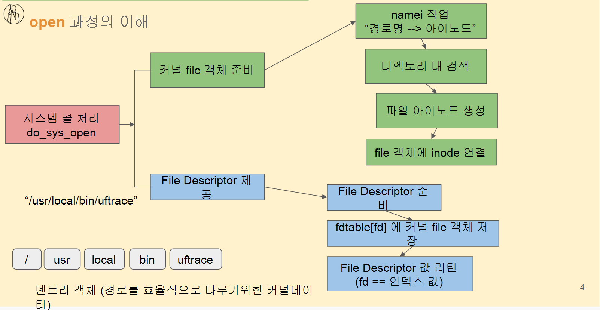

# 파일 디스크립터와 Open

```
fd값 = 배열의 index
프로세스는 struct task_struct를 통해 파일들을 관리한다
struct file은 커널이 파일을 표현하는 객체

파일을 읽고 쓰기 위한 커널 내부 구조체 실제로는 "파일"뿐 아니라 : 파일, 디렉토리, 소켓(socket)
파이프(pipe), 터미널(tty) , 장치(device) 모두 struct file로 추상화됨.

중요한 점:

struct file은 반드시 물리적인 파일을 의미하는 게 아니다.

fd를 열면 "파일처럼 다루는 모든 것"이 struct file로 추상화됨.
이게 바로 VFS(Virtual File System)의 핵심.

fd는 0,1,2는 보통 **stdin, stdout, stderr**라서 이미 차지되어 있다.

```

```
namei 작업:  경로명 -> 덴트리 -> 아이노드
dentries -> 경로를 효율적으로 다루기 위한 커널데이터(문자열로 다루게 되면 비효율적 그래서 
한번 접근하면 트리구조로 정보 누적)

file dscriptor -> 배열의 struct file주고 index 값 줌
```

# 커널 `struct file` 객체 생성

namei가 inode를 찾으면 커널은

```
struct file *file
```

을 새로 하나 만들고, 그 안에:

- inode
- 접근 모드
- 파일 위치(offset)
- f_op (read/write 함수 포인터)
- 파일 관련 상태

등을 넣는다.

---

# 파일 디스크립터 생성 과정 (fd 할당)

### ✔ 프로세스는 FD table을 갖고 있다

프로세스의 task_struct 안에는:

```
task_struct
 └─ files (files_struct)
       └─ fdtable
             └─ fd[] → struct file*

```

여기에서 **비어 있는 index** 를 찾는다:

- 0 = stdin
- 1 = stdout
- 2 = stderr
- 그 다음 3부터 비어 있으면 3을 할당

### ✔ “File Descriptor 제공”이란?

> fdtable에서 빈 자리를 찾고, 그 인덱스를 fd 값으로 넘겨주는 것
> 

### ✔ “fdtable[fd]에 struct file 저장”

결국 다음처럼 연결함:

```
fd = 3
fdtable[3] = (struct file *)file;

```

---

# 5) 최종 반환 값

유저에게 반환되는 값은 **fd = 인덱스번호**

```
return fd; /* 예: 3 */

```




---


---

```
server접속하는게 file하고 무슨관련이 있는가하면 -> VFS 개념없는것 -> 모두 파일들로 관리되기 때문에
만약 server에 client 가 너무 많이 접속하면 too many open files가 나올 수 있다. -> 이게 open 가능한 파일개수 넘어섰기 때문

- 서버 접속도 결국 소켓 파일을 open하는 것과 동일한 작업
- 소켓은 struct file로 관리되며 fd table에 들어감
- 접속이 많아지면 open 가능한 fd 개수 limit을 넘을 수 있음
- 그래서 Too many open files 에러가 발생한다
- 이는 “파일 시스템 문제가 아니라, fd 리소스 부족 문제”다
```

VFS(Virtual File System)의 설계 철학이:

> Everything is a file.
> 

그래서 실제 파일뿐 아니라:

- **소켓(Socket)**
- **TCP 연결**
- **파이프(pipe)**
- **네트워크 연결**
- **장치(device file)**
- **터미널(TTY)**

전부 다 `struct file` 객체로 표현되고, fd로 관리된다.

즉:

### 👉 서버에서 클라이언트 1명이 접속하면

리눅스 커널은 그 TCP 연결을 **“파일 하나 연 것처럼” 처리**한다.

즉:

```
client 접속 1개 = 커널 내부 struct file 객체 1개 생성
               = fd 1개 사용

```

---

# 리다이렉트와 파이프가 어떻게되는것인가?


# 1️⃣ 리다이렉션: `echo 'hello' > hello.txt`

### uftrace 결과

```
open("hello.txt", O_TRUNC|O_CREAT|O_WRONLY) = 4
dup2(4, 1) = 1   // 새로운 fd=4를 stdout(1)으로 바꿔치기

```

## ✔ 동작 원리

### (1) 쉘이 파일을 먼저 open한다

- `hello.txt`를 연 결과 fd = **4**
- 왜 4냐?
    - 0 = stdin
    - 1 = stdout
    - 2 = stderr
        
        → 그다음 빈 fd = 4
        

### (2) `dup2(4, 1)` 실행

이게 핵심이다.

> stdout(1)을 새로 연 파일(4)로 덮어씌운다.
> 

즉:

```
fdtable[1] = fdtable[4]
```

이 순간부터:

- 프로그램이 `write(1, ...)` 하면
    
    → hello.txt로 들어간다.
    

### (3) 결과적으로 echo는 파일에 출력됨

`echo`는 stdout(1)으로 출력할 뿐인데

stdout이 hello.txt로 연결돼 있으니까

파일에 저장되는 것.

---

# 파이프(|)가 뭔지

# 이제 cat → pipe → wc 로 연결됨

전체 그림 다시 보면:

```
cat(stdout=pipe_write) → [PIPE BUFFER] → wc(stdin=pipe_read)

```

결국:

1. cat이 hello.txt 내용을 읽고
2. stdout(1)으로 write → 파이프로 들어감
3. wc가 stdin(0)에서 read → 파이프 내용 읽음
4. wc는 그 내용을 line count함

# 진짜 핵심 한 줄

> 파이프는 두 프로그램의 FD(1, 0)를 파이프 fd로 바꿔치기(dup2)한 것뿐이다.
>