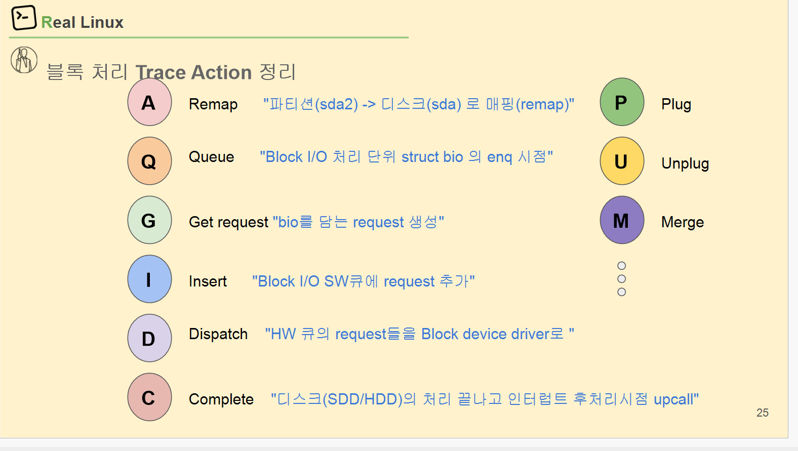
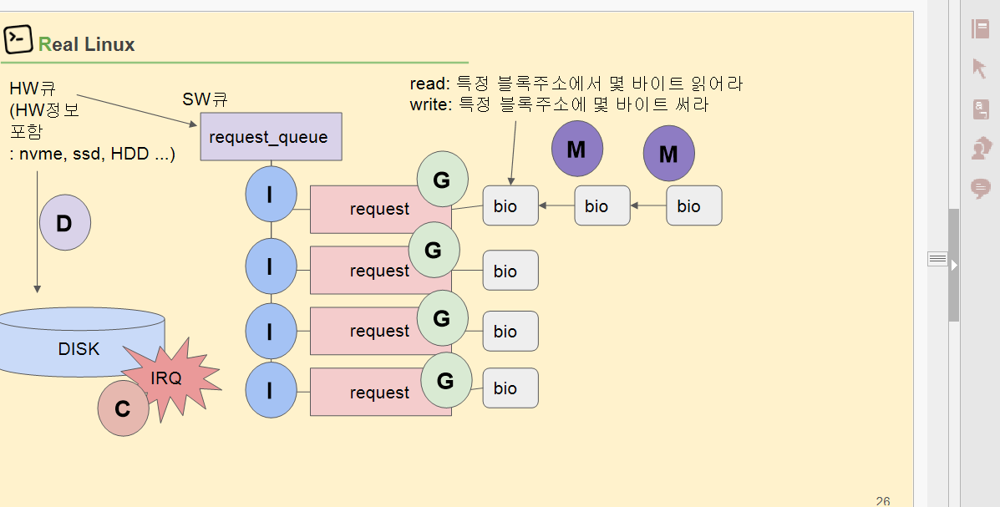
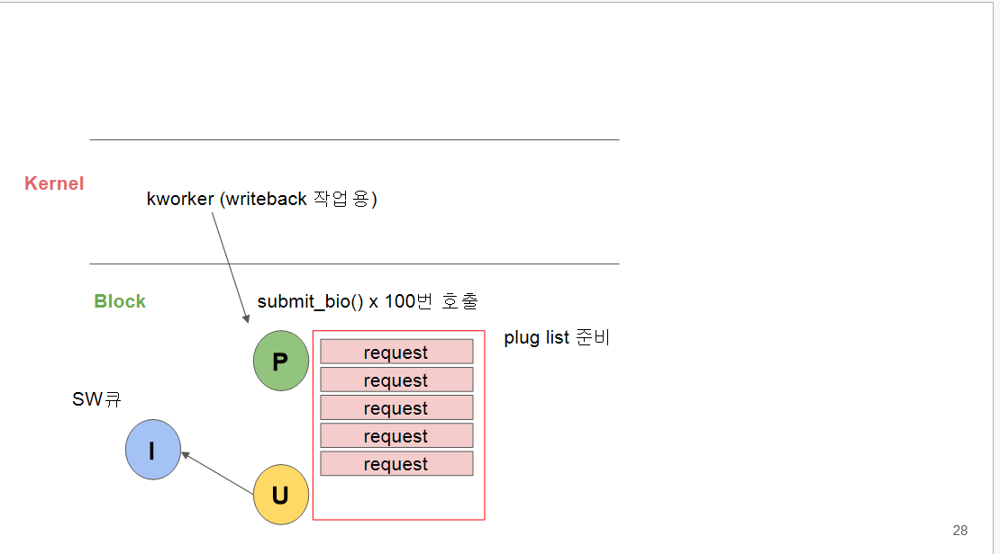
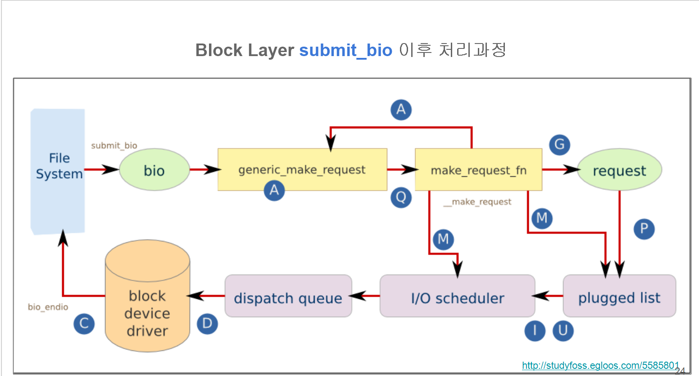

# 리눅스 Block I/O  처리 과정


- **bio**: 파일시스템이 만든 “I/O 조각(블록 범위와 버퍼 포인터)”. 가볍고 여러 개.
- **request**: 스케줄러/드라이버 단계에서 쓰는 “디스크 요청 묶음”. 여러 bio가 합쳐질 수 있음.
    
    # Trace Action 한글 치트시트
    
    - **A – Remap**
        
        파티션→실디스크 섹터로 좌표 변환. 예) `sda2` 오프셋을 더해 `sda`의 LBA로 **재매핑**.
        
    - **Q – Queue**
        
        bio를 블록 레이어로 **enqueue** 시작(요청 준비 들어감). 흔히 `generic_make_request()` 경로 초입.
        
    - **G – Get request**
        
        스케줄러가 쓸 **request 객체 할당/획득**
        
        . 여기에 bio들이 담길 그릇 마련.
        
    - **I – Insert**
        
        만들어진 request를 **I/O 스케줄러 큐에 삽입**. (deadline, mq-deadline, bfq 등)
        
    - **D – Dispatch**
        
        스케줄러가 준비된 request를 **디바이스 드라이버로 전달**(HW 큐로 내려감).
        
    - **C – Complete**
        
        디스크 작업 끝. 드라이버가 완료를 올리고, 상위로 **interrupt/upcall** → bio endio 호출.
        
    - **P – Plug**
        
        잠깐 **모아두기 시작**. 같은 프로세스/CPU에서 연속 bio를 “plugged list”에 붙여두어 병합/정렬 기회 확보.
        
    - **U – Unplug**
        
        **비우기/방출**. plugged list의 bio들을 스케줄러로 흘려보냄(→ I 단계들 발생).
        
    - **M – Merge**
        
        인접 bio/request를 **병합**(front/back/상호 병합). 디스크 왕복 줄이고 대역 효율↑.
        
    
    # 그림 2의 화살표랑 매핑
    
    1. `submit_bio()`로 **bio**가 올라옴
    2. **generic_make_request**:
        - **A**(remap)로 파티션→디스크 LBA 보정
        - **Q**: bio 큐잉 시작
    3. **make_request_fn**(드라이버/스택 하단 진입점):
        - **G**: request 그릇 마련
        - **M**: 가능한 한 병합
        - **P**: 잠깐 plug에 쌓아두거나
        - **I**: 스케줄러 큐에 삽입
        - **U**: 타이밍/조건 맞으면 unplug로 한꺼번에 방출
    4. **I/O scheduler** → **dispatch queue**
        - **D**: 드라이버(HBA/NVMe/SATA)로 내려보냄
    5. **block device driver**가 디스크에 실제 I/O 수행
        - 완료되면 **C**: 완료 통지, bio_endio, 상위 fs로 콜백
    
    # 한 눈에 보는 전형적 시나리오
    
    - 작은 연속 쓰기 다발:
        
        `P → Q → G → M(여러 bio가 하나로) → I → D → C`
        
    - 파티션 있는 장치:
        
        `A`가 먼저 한 번 찍힘(재매핑) → 그 다음 `Q, G, …`
        
    - 병합 여지 없고 곧바로 내려갈 때:
        
        `Q → G → I → D → C` (중간에 `P/M`이 생략될 수 있음)
        
    
    # 자주 묻는 포인트 정리
    
    - **왜 Plug/Unplug?**
        
        너무 자주 스케줄러에 던지면 조각난 I/O가 늘어 효율이 떨어짐. 잠깐 모았다가(Plug) 인접한 것끼리 합쳐(Merge) 한 번에 내리기 위해.
        
    - **Queue(I)와 Dispatch(D)의 차이**
        
        `I`는 “스케줄러의 **소프트웨어 큐**에 넣음”, `D`는 “그 큐에서 골라 **드라이버/HW 큐**로 내려보냄”.
        
    - **bio vs request**
        
        bio는 상위 레벨의 작은 단위, request는 디스크에 맞게 **합쳐진 실제 전송 단위**.
        





---

# 한눈 정리

- **bio** = 조각 데이터(“이 LBA부터 N바이트 읽/쓰기”)
- **request** = 여러 bio를 한데 묶은 실제 전송 단위
- **SW 큐(request_queue)** = 커널의 소프트웨어 대기열(스케줄러가 정렬/병합)
- **HW 큐** = 디바이스 드라이버/컨트롤러 쪽 대기열(NVMe는 여러 개, HDD/SATA는 보통 1개)
- **C(Complete)** = 디스크가 끝냈다고 **IRQ**로 알림

# 알파벳이 의미하는 동작(그림 기준)

1. **M (Merge)**
    
    인접한 bio들을 서로 이어 붙여 더 큰 작업으로 만듦. (그림의 bio↔bio 연결)
    
2. **G (Get request)**
    
    병합한 bio들을 담을 **request** 객체를 마련.
    
3. **I (Insert)**
    
    만든 request를 **SW 큐(request_queue)** 에 넣음. (스케줄러 단계)
    
4. (스케줄러가 순서/마감(deadline) 고려해서 고름)
5. **D (Dispatch)**
    
    골라진 request를 **HW 큐(디바이스 드라이버)** 로 내려 보냄 → 실제 디스크 명령 전송.
    
6. **C (Complete)**
    
    디스크 작업 완료 → **IRQ**로 통지 → 상위로 “끝!” 콜백.
    

# 읽기/쓰기는 뭐가 다르나?

- **read**: “특정 블록 주소에서 N바이트 **읽어라**”
- **write**: “특정 블록 주소에 N바이트 **써라**”
    
    둘 다 흐름은 동일(차이는 캐시/플러시 정책에서 생김).
    

# 왜 M(병합)을 하냐?

- 작은 bio를 합쳐 한 번에 보내면 **왕복/시킹**이 줄고 **처리량↑, 지연↓**
- NVMe처럼 병렬 큐가 많은 장치에서도 큰 I/O가 더 효율적.

# 아주 짧은 시나리오

```
bio 여러 개 생성
 → M(가능하면 병합)
 → G(request 확보)
 → I(SW 큐에 삽입)
 → D(HW 큐/장치로 전송)
 → C(IRQ로 완료 통지)

```



---

좋아, 이 슬라이드는 **Plug/Unplug이 왜 필요한지**를 보여주는 장면이야. “kworker가 페이지를 디스크로 쓰는(writeback) 동안 무슨 일이 일어나는가?”를 아주 쉽게:

# 무슨 상황?

- 커널의 **kworker**가 더티 페이지를 디스크에 쓰려고
    
    `submit_bio()`를 **수십~수백 번 연속 호출**함. (그림엔 ×100)
    

# Plug( P ) — “잠깐 바구니에 담아 모으기”

- 매 호출마다 바로 스케줄러 큐로 던지지 않고,
    
    같은 CPU/쓰레드 컨텍스트에서 나온 I/O를 **plug list**라는
    
    임시 바구니에 **잠깐 쌓아둔다**.
    
- 목적: **병합(Merge)**·**정렬** 기회를 만들고, 장치로 가는
    
    **왕복 횟수**를 줄여 **처리량↑ 지연↓**.
    

# Unplug( U ) — “이제 한 번에 쏟기”

- 조건이 되면 바구니의 요청들을 **한꺼번에** SW 큐(스케줄러)로 보냄(→ **I**).
- 언제 U가 발생?
    - `blk_finish_plug()` 호출 시(시스템콜/커널 루틴 끝나며 자동 호출)
    - 바구니가 충분히 찼을 때(크기 한도)
    - 시간이 조금 지나 타임아웃이 됐을 때
    - 동기 I/O 등 즉시 내려보내야 할 상황

# 그다음 흐름(그림의 I → D → C)

1. **I (Insert)**: 스케줄러 큐에 넣음
2. **D (Dispatch)**: 스케줄러가 골라 **드라이버/HW 큐**로 보냄
3. **C (Complete)**: 장치가 끝냈다고 **IRQ**로 완료 통지

# 왜 이렇게 하냐? (핵심 요약)

- writeback처럼 **작은 쓰기**가 연달아 많이 생길 때,
    
    P → U로 **묶어서** 내리면
    
    - 인접 블록끼리 **병합**돼 **큰 I/O**로 바뀜
    - HDD는 탐색/회전 손실이 줄고, NVMe도 명령/큐 관리 오버헤드가 줄어듦
- 너무 자주 D를 하면 “자잘한 I/O 홍수” → 성능 저하

# 기억 공식

`submit_bio()×많이  →  P(모으기)  →  U(한꺼번에 방출)  →  I → D → C`

