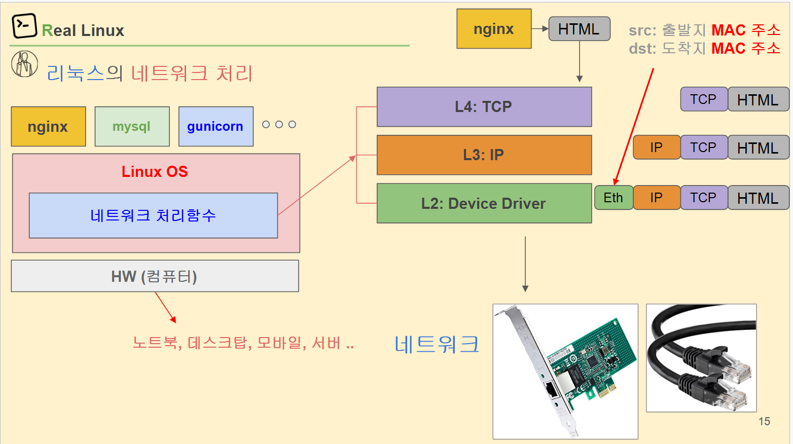
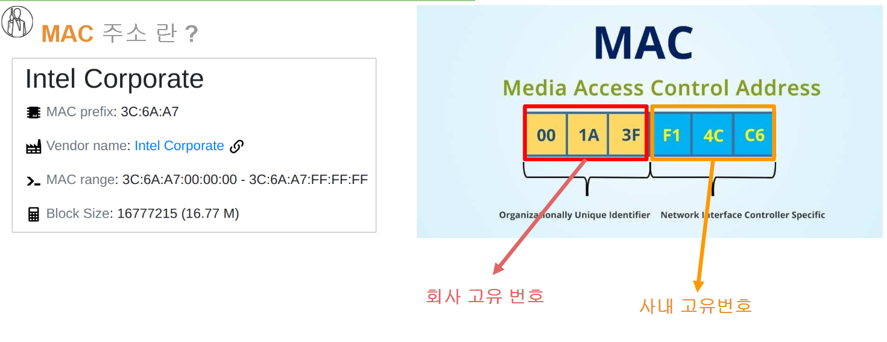
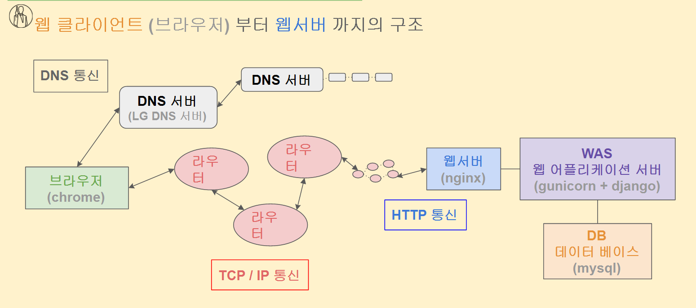
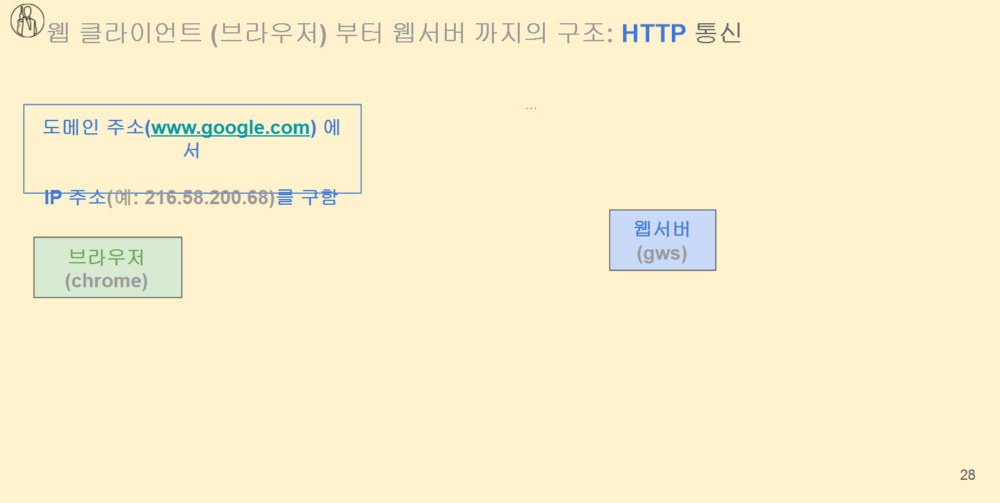
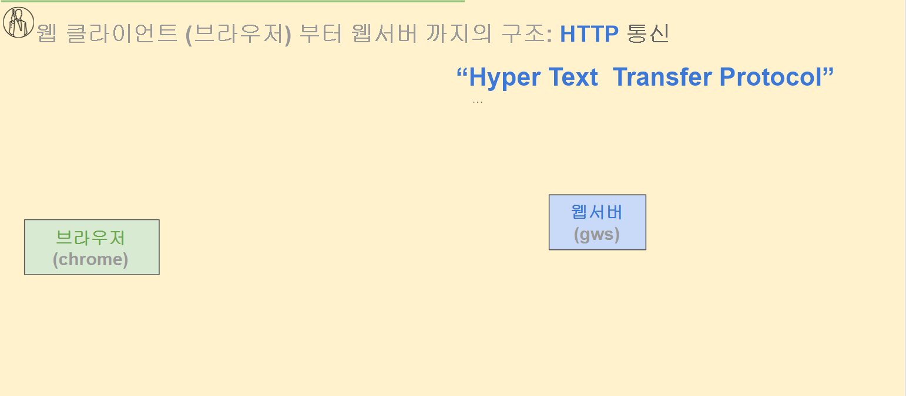
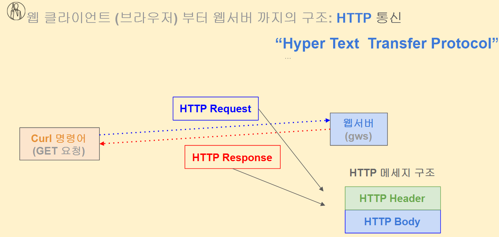
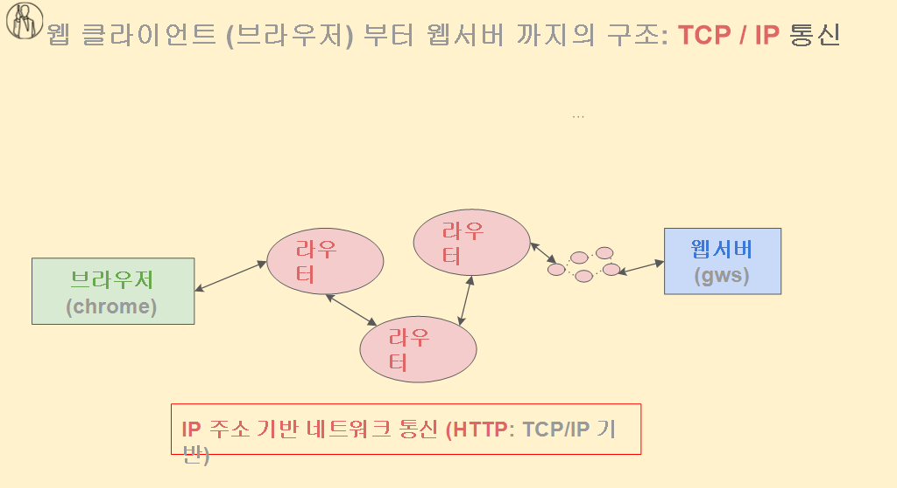

```
리눅스는 네트워크 자원을 처리하기 위해 네트워크 처리함수가 존재 한다. L2: device driver ,L3 : IP ,L4 : TCP 처리를 할 수 있다.
소프트웨어 적으로 TCP IP 를 처리 할 수 있다. 그러나 하드웨어 적으로 메모리카드를 써서 처리할 수 있다.

MAC 주소 통신이 내부망 통신할 때랑 외부망 통신 할 때랑 다르다. 
내부망 통신을 할 때는 des MAC 주소에는 최종 목적지의 주소가 적히게 되지만
외부망 통신을 하게 되면 des MAC 주소에는 최종 목적지 주소가 아니라 gateway의 주소가 쓰기게 되고 가면 갈 수록 최종 목적지를 향하게 된다. (routing 과정)

```





# 웹 클라이언트 (브라우저) 부터 웹서버 까지의 구조(overview)

```
패킷을 전달하려면 ip 주소 port 번호를 알아야됨. 

http 통신은 application 에서 발생

프로토콜은 데이터를 주고 받을 때의 일련의 약속들

```










```bash
# curl 명령어를 통한 HTTP: GET 요청
$ curl -vI www.google.com 2>&1 | grep "> "
> HEAD / HTTP/1.1
> Host: www.google.com
> User-Agent: curl/7.58.0

# curl 명령어를 통한 HTTP Response 응답 Header
curl -vI www.google.com 2>&1 | grep "< "
< HTTP/1.1 200 OK
< Content-Type: text/html; charset=ISO-8859-1
< P3P: CP="This is not a P3P policy! See g.co/p3phelp for more info."  
< Date: Thu, 28 May 2020 09:54:06 GMT
< Server: gws
< X-XSS-Protection: 0
< X-Frame-Options: SAMEORIGIN
< Transfer-Encoding: chunked
< Expires: Thu, 28 May 2020 09:54:06 GMT
< Cache-Control: private
< Set-Cookie: ...

```

```bash
# traceroute를 통한 구글 서버까지의 여정 추적 (라우터 추적) 
$ traceroute -n www.google.com
traceroute to www.google.com (172.217.161.164), 30 hops max, 60 byte packets  
 1  192.168.0.1  3.434 ms  3.378 ms  3.343 ms
 2  106.254.212.17  8.990 ms  9.004 ms  8.982 ms
...
13 ... 172.217.161.164  41.344 ms
```


