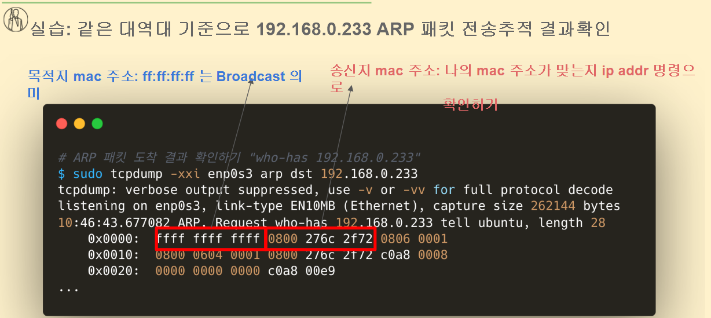

```
ICMP 란?
L3 통신
ICMP(internet control message protocol)
라우터를 포함한 네트워크 장치가 다른 IP 주소와 통신 할 때 성공 또는 실패를 나타내는 오류 메시지 및 운영 정보를 보내는 데 사용됩니다. 

ARP 란 ?
L2 (데이터 링크 계층) 통신
ARP(Address Resolution Protocol)는 
IP 네트워크 주소를 데이터 링크 프로토콜에서 사용하는 하드웨어 주소(Mac addr)
에 매핑하기 위해 인터넷 프로토콜 에서 사용하는 프로토콜입니다.

하드웨어 주소가 외부 망으로 나가게 되면 gateway 장비 mac 주소 들어옴. router 라던지 switch mac 주소 가져옴
내부망에서 통신하면 broadcasting하게 되서 해당 ip 주소를 가진 mac 주소를 찾게 된다.
```

ping은 icmp 패킷을 보내는 것

```
ping www.google.com
1. DNS 질의로 google.com → IP 획득
2. 목적지 IP가 내 서브넷인지 판단 (아님 → 게이트웨이로 보냄)
3. 게이트웨이 MAC 주소가 ARP로 필요 → ARP Request/Reply
4. ICMP Echo Request 패킷을 Gateway MAC으로 전송
5. 라우팅 → 구글 서버 도착 → Echo Reply 회신
6. PC가 Reply 받고 ping 통계 출력
```

```bash
# 8.8.8.8(구글 DNS server 주소) 로 보내는 ICMP 패킷 추적하기
$ sudo tshark -i enp0s3 -f icmp -Y "ip.dst == 8.8.8.8" 
Running as user "root" and group "root". This could be dangerous.
Capturing on 'enp0s3'
    1 0.000000000  192.168.0.8 → 8.8.8.8      ICMP 98 Echo (ping) request  id=0x0457, seq=1/256, ttl=64
    3 1.002379859  192.168.0.8 → 8.8.8.8      ICMP 98 Echo (ping) request  id=0x0457, seq=2/512, ttl=64  
    
$ sudo tshark -i enp0s3 -f icmp -Y "ip.dst == 8.8.8.8 or ip.src == 8.8.8.8"
  # 오직 8.8.8.8로 가는 패킷 또는 8.8.8.8에서 오는 패킷만 화면에 보여라.
  
  
# naver로 ping을 계속 보냄 그러나 response가 오지 않음
$ sudo tshark -i enp0s3 -f icmp -Y "ip.dst == 23.212.12.248 or ip.src == 23.212.12.248"
Running as user "root" and group "root". This could be dangerous.
Capturing on 'enp0s3'
    4 6.649399224 172.30.129.108 → 23.212.12.248 ICMP 98 Echo (ping) request  id=0x11b9, seq=1/256, ttl=64
    5 6.657710681 23.212.12.248 → 172.30.129.108 ICMP 98 Echo (ping) reply    id=0x11b9, seq=1/256, ttl=46 (request in 4)
    6 7.651174933 172.30.129.108 → 23.212.12.248 ICMP 98 Echo (ping) request  id=0x11b9, seq=2/512, ttl=64
    7 7.659226742 23.212.12.248 → 172.30.129.108 ICMP 98 Echo (ping) reply    id=0x11b9, seq=2/512, ttl=46 (request in 6)
    8 8.653570327 172.30.129.108 → 23.212.12.248 ICMP 98 Echo (ping) request  id=0x11b9, seq=3/768, ttl=64
    9 8.661957904 23.212.12.248 → 172.30.129.108 ICMP 98 Echo (ping) reply    id=0x11b9, seq=3/768, ttl=46 (request in 8)
   10 9.655761786 172.30.129.108 → 23.212.12.248 ICMP 98 Echo (ping) request  id=0x11b9, seq=4/1024, ttl=64
   11 9.663687140 23.212.12.248 → 172.30.129.108 ICMP 98 Echo (ping) reply    id=0x11b9, seq=4/1024, ttl=46 (request in 10)
   12 10.659288292 172.30.129.108 → 23.212.12.248 ICMP 98 Echo (ping) request  id=0x11b9, seq=5/1280, ttl=64
   13 10.667260511 23.212.12.248 → 172.30.129.108 ICMP 98 Echo (ping) reply    id=0x11b9, seq=5/1280, ttl=46 (request in 12)
   14 11.661576801 172.30.129.108 → 23.212.12.248 ICMP 98 Echo (ping) request  id=0x11b9, seq=6/1536, ttl=64
   15 11.669683096 23.212.12.248 → 172.30.129.108 ICMP 98 Echo (ping) reply    id=0x11b9, seq=6/1536, ttl=46 (request in 14)
   16 12.664339138 172.30.129.108 → 23.212.12.248 ICMP 98 Echo (ping) request  id=0x11b9, seq=7/1792, ttl=64
   17 12.672689418 23.212.12.248 → 172.30.129.108 ICMP 98 Echo (ping) reply    id=0x11b9, seq=7/1792, ttl=46 (request in 16)
```

```bash
# ip neigh 명령을 통해서 ARP table 확인하기
$ ip neigh 
192.168.0.18 dev enp0s3 lladdr 3c:6a:a7:c4:5a:8b REACHABLE
192.168.0.1 dev enp0s3 lladdr 88:36:6c:ec:ae:42 REACHABLE

# arp 명령을 통해서 ARP table 확인하기
$ arp
Address                  HWtype  HWaddress           Flags Mask            Iface
192.168.0.18             ether   3c:6a:a7:c4:5a:8b   C                     enp0s3
_gateway                 ether   88:36:6c:ec:ae:42   C                     enp0s3  

# ARP 패킷 보내는 과정 추적하기
$ sudo tcpdump -xxi enp0s3 arp
tcpdump: verbose output suppressed, use -v or -vv for full protocol decode
listening on enp0s3, link-type EN10MB (Ethernet), capture size 262144 bytes  

# ARP 패킷 도착 결과 확인하기 "who-has 172.30.129.233 출발지는 내 ip 주소 이렇게 해야 내가 보내는 것만 볼 수 있음"
sudo tcpdump -xxi enp0s3 arp dst 172.30.129.233 and src 172.30.129.108
tcpdump: verbose output suppressed, use -v or -vv for full protocol decode
listening on enp0s3, link-type EN10MB (Ethernet), capture size 262144 bytes
05:10:31.393009 ARP, Request who-has 172.30.129.233 tell ubuntu, length 28
        0x0000:  ffff ffff ffff 0800 276c 2f72 0806 0001
        0x0010:  0800 0604 0001 0800 276c 2f72 ac1e 816c
        0x0020:  0000 0000 0000 ac1e 81e9
05:10:32.413903 ARP, Request who-has 172.30.129.233 tell ubuntu, length 28
        0x0000:  ffff ffff ffff 0800 276c 2f72 0806 0001
        0x0010:  0800 0604 0001 0800 276c 2f72 ac1e 816c
        0x0020:  0000 0000 0000 ac1e 81e9
05:10:33.443476 ARP, Request who-has 172.30.129.233 tell ubuntu, length 28
        0x0000:  ffff ffff ffff 0800 276c 2f72 0806 0001
        0x0010:  0800 0604 0001 0800 276c 2f72 ac1e 816c
        0x0020:  0000 0000 0000 ac1e 81e9
05:10:34.469242 ARP, Request who-has 172.30.129.233 tell ubuntu, length 28
        0x0000:  ffff ffff ffff 0800 276c 2f72 0806 0001
        0x0010:  0800 0604 0001 0800 276c 2f72 ac1e 816c
        0x0020:  0000 0000 0000 ac1e 81e9
05:10:35.485794 ARP, Request who-has 172.30.129.233 tell ubuntu, length 28
        0x0000:  ffff ffff ffff 0800 276c 2f72 0806 0001
        0x0010:  0800 0604 0001 0800 276c 2f72 ac1e 816c
        0x0020:  0000 0000 0000 ac1e 81e9

	
```



```bash
# ARP 테이블에서 IP address(예시: 192.168.0.233) 삭제하기 전 조회하기
$ arp
Address                  HWtype  HWaddress           Flags Mask            Iface
192.168.0.18             ether   3c:6a:a7:c4:5a:8b   C                     enp0s3 
_gateway                 ether   88:36:6c:ec:ae:42   C                     enp0s3
192.168.0.233                    (incomplete)                              enp0s3

# ARP 테이블에서 IP address(예시: 192.168.0.233) 삭제하기
$ sudo arp -d 192.168.0.233

# ARP 테이블에서 IP address(예시: 192.168.0.233) 삭제결과 확인하기
$ arp
Address                  HWtype  HWaddress           Flags Mask            Iface
192.168.0.18             ether   3c:6a:a7:c4:5a:8b   C                     enp0s3
_gateway                 ether   88:36:6c:ec:ae:42   C                     enp0s3

# ping 192.168.0.233 임의로 테스트 후
$ ping 192.168.0.233

# 현재 ARP 테이블 확인하기
$ ip neigh
192.168.0.18 dev enp0s3 lladdr 3c:6a:a7:c4:5a:8b REACHABLE
192.168.0.1 dev enp0s3 lladdr 88:36:6c:ec:ae:42 DELAY
192.168.0.233 dev enp0s3  INCOMPLETE

# ARP 테이블 모두 비우기
$ sudo ip neigh flush all

# ARP 테이블 비워졌는지 확인하기
# 참고: gateway 또는 ssh 접속한 나의 호스트 IP 는 남아있을 수 있다  
$ ip neigh
$ arp
```