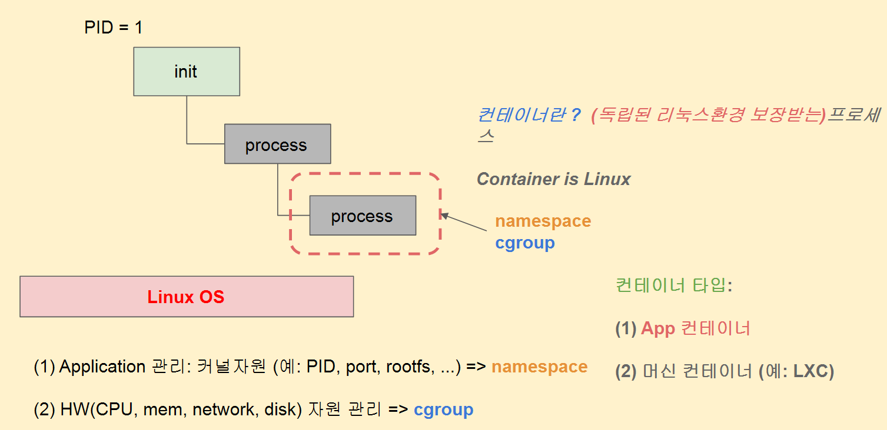
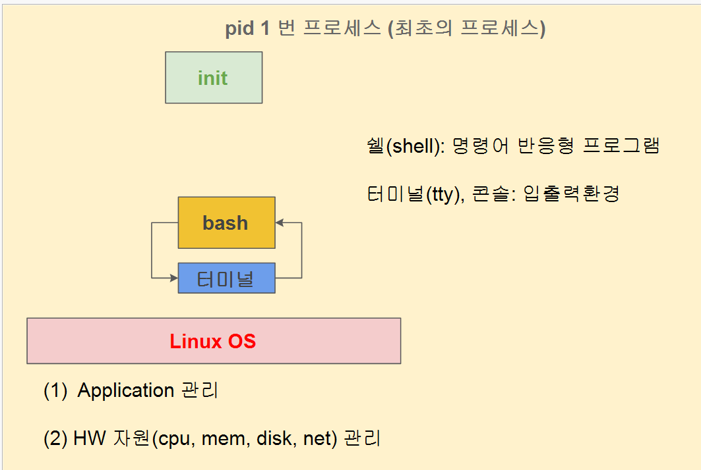
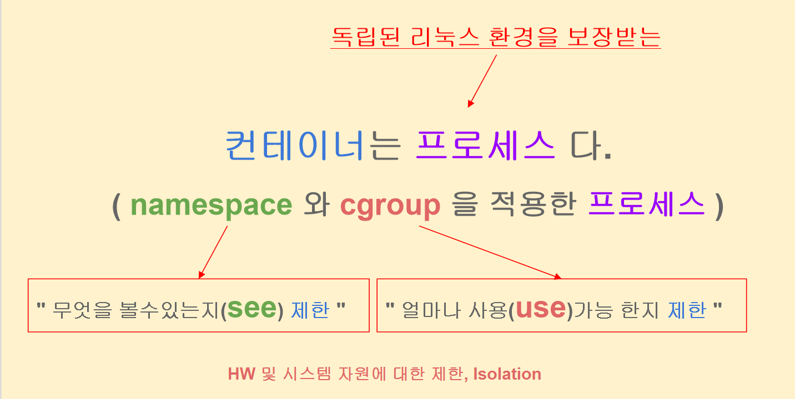
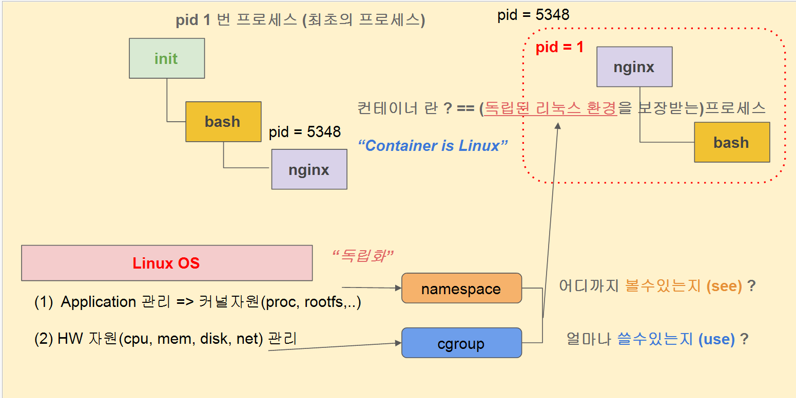
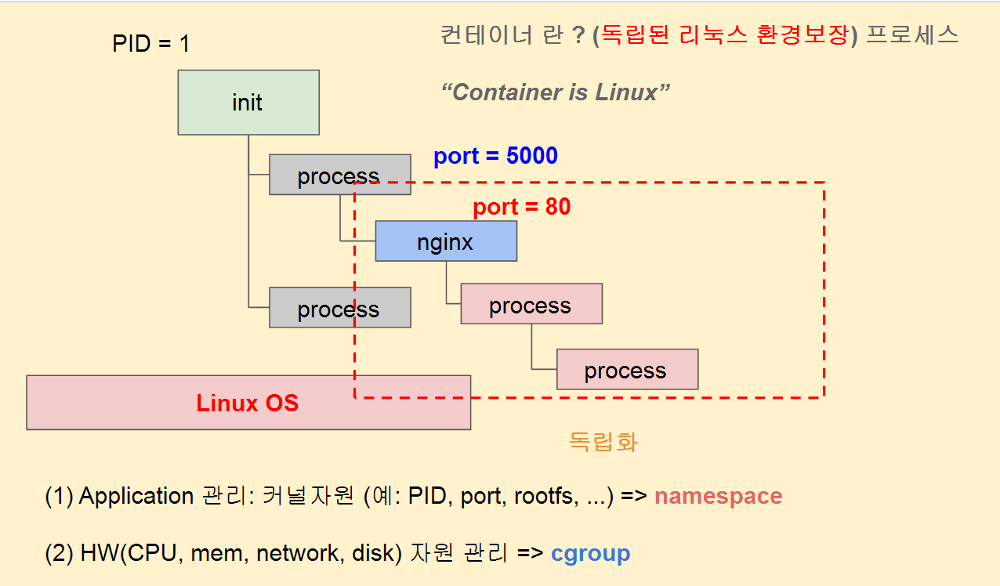

# 리눅스와 컨테이너의 이해

```
namespace랑 cgroup 기능을 적용하면 PID, port, rootfs를 따로 관리가능하다. 
ex) etc, bin 폴더 들을 독립되서 따로 쓸 수 있다.

ps 로는 어떤게 컨테이너화가 된 프로세스인지는 알 수 없다.
컨테이너화된 프로세스를 좀 더 간편하게 관리하는 것 -> docker
수천개 수만개 수억개 서버 운영에서 관리할 수 있게 해주는 것 -> kubernetes

컨테이너 = 프로세스다.
1app 1container 가 일반적

1container 안에 여러개의 프로세스를 넣을 순 있다. 부모프로세스 아래 자식프로세스로

프로세스 간 충돌이 발생 할 수 있다. -> 여러 프로세스를 깔다보면 설정이 겹칠 수 있다.
컨테이너로 관리하게 되면 다르다. -> 똑같은 리눅스 환경을 유지가능하다. (os 환경에 영향 x)

```










```
컨테이너화를 시키면 그 프로세스가 독립된 환경을 가지게 되기 때문에 포트번호 80을 사용하는 프로세스가 많아도 상관없다.
다른 프로세스와의 충돌을 고려하지 않아도 된다.

```