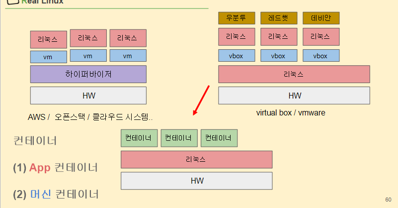

# 이미지 vs 컨테이너 / 가상머신 vs 컨테이너


```
이미지에 각자의 linux가 존재하게 되면 용량 낭비가 아닌가? 

내부적으로 이미지에 대한 관리가 image layer에 대한 원리로 관리되어 진다.
이미지의 내부의 linux는 중복 내용은 공용처리 되고 다른 내용만 따로 처리된다. -> copy on write ( cow ) 라고 불린다.

일반적인 배포방식은 binary 파일(실행파일만 주는 것)
	장점 : 용량이 작다.
	
이미지화를 해서 보낸다
	장점 : 
	단점 : 용량이 커진다. -> 해결을 위해 docker file(14kb 텍스트 파일)을 쓴다. 훨씬 간편하고 용량이 작게 관리가능
												 docker file을 쓰면 어떤 명령어로 관리가 되었는지 스크립트를 통해서 확인이 가능하다.
												이게 좋은 이유가 linux 서버가 여러 사람을 거치며 어떻게 관리 되었는지 알 수 가 없는데 
												이것을 한 눈에 스크립트로 확인이 가능한게 혁명이다.
```

```
가상머신 vs 컨테이너

컨테이너 종류 : app container , machine container

```

