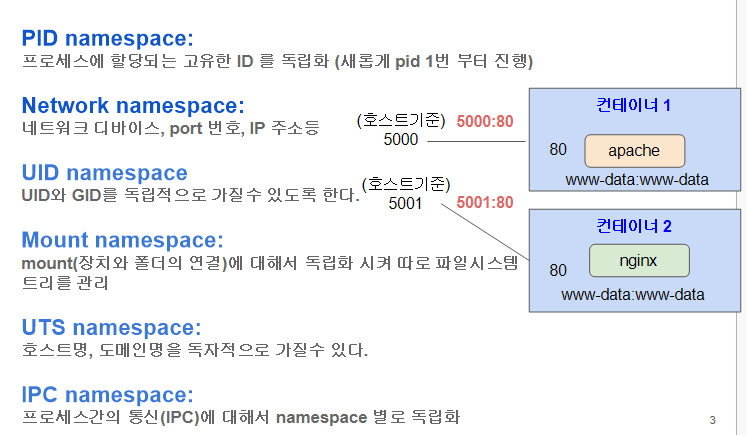

# 컨테이너 원리분석 : namespace 추적
```
namespace를 적용한다는게 container 에서 가장 중요한 개념이다.
process를 운영을 할 떄 시스템 자원의 충돌 부분을 막는게 1차적인 목적이다.

namespae : 여러가지 부분이 존재한다. 
```



```
ps -ef를 했을 때 모든 프로세스가 나오게 되는데 container화가 된건지 아닌지 확인하는 방법은? 
lsns -p [Pid] 로

컨테이너가 아닌 일반 프로세스는 PID 1(init)의 namespace를 공유한다.
그러나 container화가 되면 달라지게 된다. 
```

```bash
# 컨테이너(ubuntu 기반 bash 쉘) 실행하기   
$ docker run -it -d ubuntu:16.04

# 컨테이너 확인하기
$ docker ps

# 현재 실행중인 컨테이너 PID 기준으로 namespace 정보 확인하기  
$ docker ps
$ docker inspect [컨테이너 ID] | grep Pid
$ sudo lsns -p [컨테이너 PID]

# 호스트의 init 프로세스 기준 namespace 확인하기
$ ll /proc/1/ns

# 컨테이너 프로세스 기준 namespace 확인하기
$ ll /proc/[컨테이너 PID]/ns

$ unshare --mount --uts --ipc --net --pid --fork --user  --map-root-user chroot rootfs /bin/bash

# namespace 가 적용된 bash 쉘 안에서
# 실제 프로세스 ID 와는 다르게 PID = 1 으로 확인된다
$ echo $$   
1
$ mount -t proc proc /proc
$ ps -ef
UID          PID    PPID  C STIME TTY          TIME CMD
root           1       0  0 09:51 ?        00:00:00 /bin/bash
root           3       1  0 10:19 ?        00:00:00 ps -ef

# 독립적인 network namespace
$ ip link
1: lo: <LOOPBACK> mtu 65536 qdisc noop state DOWN mode DEFAULT group default qlen 1000
    link/loopback 00:00:00:00:00:00 brd 00:00:00:00:00:00
    
#다른 터미널 통해서 unshare 로 실행한 (namespace적용한) 프로세스 실제 PID 확인
$ pidof unshare
3949
# namespace 정보 확인하기
$ lsns -p 3949
        NS TYPE   NPROCS   PID USER      COMMAND
4026531835 cgroup      9  1064 reallinux /lib/systemd/systemd --user
4026531836 pid         8  1064 reallinux /lib/systemd/systemd --user
4026532303 user        2  3949 reallinux unshare --mount --uts --ipc --net --pid --fork --user -
4026532304 mnt         2  3949 reallinux unshare --mount --uts --ipc --net --pid --fork --user -
4026532305 uts         2  3949 reallinux unshare --mount --uts --ipc --net --pid --fork --user -
4026532306 ipc         2  3949 reallinux unshare --mount --uts --ipc --net --pid --fork --user -
4026532309 net         2  3949 reallinux unshare --mount --uts --ipc --net --pid --fork --user -
$ ll /proc/3949/ns
total 0
dr-x--x--x 2 reallinux reallinux 0 Jan 19 10:24 ./
dr-xr-xr-x 9 reallinux reallinux 0 Jan 19 10:24 ../
lrwxrwxrwx 1 reallinux reallinux 0 Jan 19 10:24 cgroup -> 'cgroup:[4026531835]'
lrwxrwxrwx 1 reallinux reallinux 0 Jan 19 10:24 ipc -> 'ipc:[4026532306]'
lrwxrwxrwx 1 reallinux reallinux 0 Jan 19 10:24 mnt -> 'mnt:[4026532304]'
lrwxrwxrwx 1 reallinux reallinux 0 Jan 19 10:24 net -> 'net:[4026532309]'
lrwxrwxrwx 1 reallinux reallinux 0 Jan 19 10:24 pid -> 'pid:[4026531836]'
lrwxrwxrwx 1 reallinux reallinux 0 Jan 19 10:24 pid_for_children -> 'pid:[4026532307]'
lrwxrwxrwx 1 reallinux reallinux 0 Jan 19 10:24 user -> 'user:[4026532303]'
lrwxrwxrwx 1 reallinux reallinux 0 Jan 19 10:24 uts -> 'uts:[4026532305]'
```

```
컨테이너는 새로운 PID namespace를 생성한다.
따라서 호스트에서 보이는 프로세스 PID와
컨테이너 내부에서 보이는 PID는 다르다.
컨테이너 내부에서는 최초로 실행된 프로세스가 PID 1로 보이며,
이는 실제 시스템의 init이 아니라 namespace 내부의 init 역할을 한다.
```

## Docker랑 무슨 관계냐면

### 핵심 한 문장

> Docker는 내부적으로 unshare랑 같은 커널 기능을 쓴다.
> 

차이점은:

| unshare | Docker |
| --- | --- |
| 직접 다 설정해야 함 | 자동으로 다 해줌 |
| 실험용 / 학습용 | 실무용 |
| 네트워크 없음 | 네트워크 자동 연결 |
| 파일시스템 단순 | 이미지/레이어 관리 |

👉 **Docker = unshare + cgroup + 자동화**

```bash
# nsenter 명령어를 통해서 namespace 적용된 프로세스
# 내부 확인하기
$ sudo nsenter -t [namespace 적용된 프로세스 PID] -p -r ps -ef
$ sudo nsenter -t [namespace 적용된 프로세스 PID] -p -r top
$ sudo nsenter -t [namespace 적용된 프로세스 PID] -p -u hostname 

# 모든 namespace 적용해서 동일한 프로세스 실행
$ sudo nsenter -t [namespace 적용된 프로세스 PID] -p -a

```

## 1️⃣ `nsenter` 한 줄 정의

> nsenter는 “이미 만들어진 namespace 안으로 들어가는 명령어”다.
> 
- `unshare` → **방 만들기**
- `nsenter` → **이미 있는 방 들어가기**