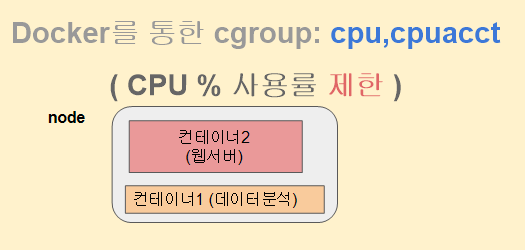

# Docker를 통한 cgroup 분석 : CPU 사용률 제한

```
docker를 통한 cpu 사용률 제한이 필요한 이유
- 노드(물리적인 서버를 지칭)
	만약 사진과 같이 존재하면 데이터 분석을 할 때 웹서버가 많은 cpu를 먹어서 데이터 분석이
	오래걸리게 될 수 있기에 웹서버에 cpu 사용량을 제한을 걸어서 사용하게 할 수 도 있다.
```

## docker를 통한 cpu 제한 실습



```bash
# ubuntu 18.04 이미지가 없다면 설치 후 실행된다.
$ sudo docker run -it ubuntu:18.04 /bin/bash   

# 우분투 18.04 컨테이너 접속 후 종료
root@cca72c8dce3b:/# exit

# 방금전 종료된 CONTAINER ID 알아내기
$ sudo docker ps -a

# 해당 CONTAINER ID 를 통해서 되살리기
$ sudo docker start <CONTAINER ID>

# 재시작된 우분투 컨테이너에 접속하기 (Enter 키 여러번 누르기) 
$ sudo docker attach <CONTAINER ID>

# 새로운 컨테이너를 생성하지않고
# 기존 컨테이너 cgroup 설정값 변경가능하다 
$ sudo docker update --cpu-quota=500000 [CONTAINER ID] 

# period 스케줄링 기준 시간 100ms == 100,000 us
# quota CPU 사용 제한 시간  50ms ==  50,000 us
# 결과적으로 1/2 CPU 50% 사용률 제한 
$ docker run --cpu-period=100000 --cpu-quota=50000 -it ubuntu:18.04 /bin/bash  

# 다른 터미널에서 top 로 cpu 점유율 모니터링 준비
$ top

# 도커로 실행한 해당 컨테이너 터미널에서
# sysbench 프로그램을 설치하자
root@600fe864ca9b:/# apt update && apt install sysbench 

# CPU 테스트 (소수계산) 진행하고
# 총 total 시간 확인하자
root@600fe864ca9b:/# sysbench --test=cpu run

# 다른터미널에서 top 도 확인하기 (CPU 사용률 50% 예상)

# period 스케줄링 기준 시간 100ms == 100,000 us
# quota CPU 사용 제한 시간  25ms ==  25,000 us
# 결과적으로 1/4 CPU 25% 사용률 제한 
$ docker run --cpu-period=100000 --cpu-quota=25000 -it ubuntu:18.04 /bin/bash 

# 다른 터미널에서 top 로 cpu 점유율 모니터링 준비
$ top
```