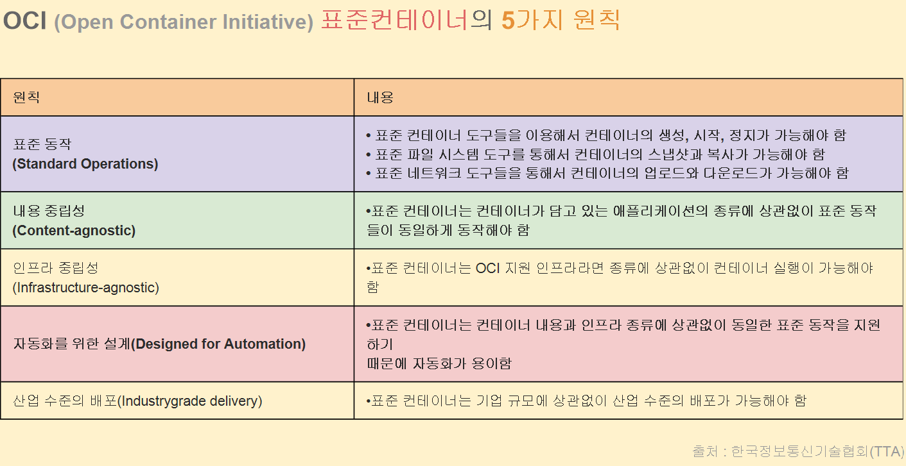
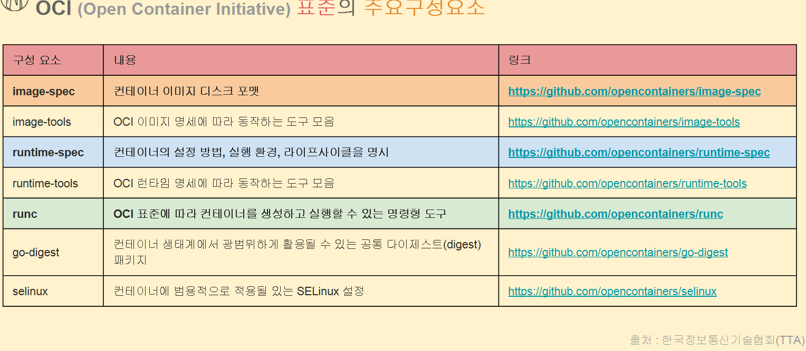
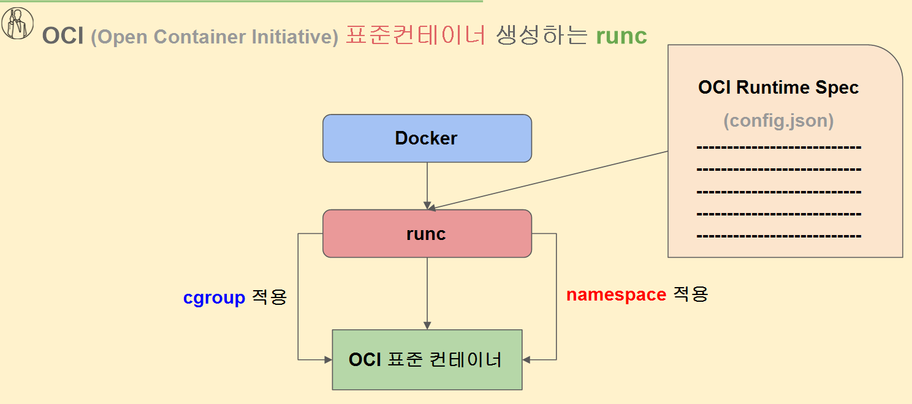

# 컨테이너 생성원리와 OCI / runc 이해

```
컨테이너는 OCI라는 ‘약속(표준)’을 따르고,
그 OCI 약속에 맞춰 컨테이너를 실제로 실행하는 구현체가 runc다.
```

### 1️⃣ 컨테이너 자체에는 “표준(약속)”이 필요함

컨테이너는

- 파일시스템
- 프로세스
- 네임스페이스
- cgroups

같은 **리눅스 기능을 묶은 개념**이야.

그런데 **“어떻게 만들어야 컨테이너라고 부를 수 있지?”**라는 문제가 생김.

→ 그래서 나온 게 **OCI 규약**

내용 중립성 : 어플리케이션의 어떤 종류나 상관없이 컨테이너를 관리나 운영할 때 동일하게 컨트롤 되어야 한다.





### 2️⃣ runc = OCI Runtime Spec을 구현한 실제 실행기

여기서 등장하는 게 **runc**

- runc는
    
    👉 **OCI Runtime Spec을 그대로 구현한 프로그램**
    
- 즉,
    - namespace 설정
    - cgroup 설정
    - rootfs 마운트
    - 프로세스 실행

이 모든 걸 **리눅스 시스템 콜로 실제 수행**

📌 그래서:

> OCI 규약에 맞춰 컨테이너를 실제로 구동하는 게 runc
> 

