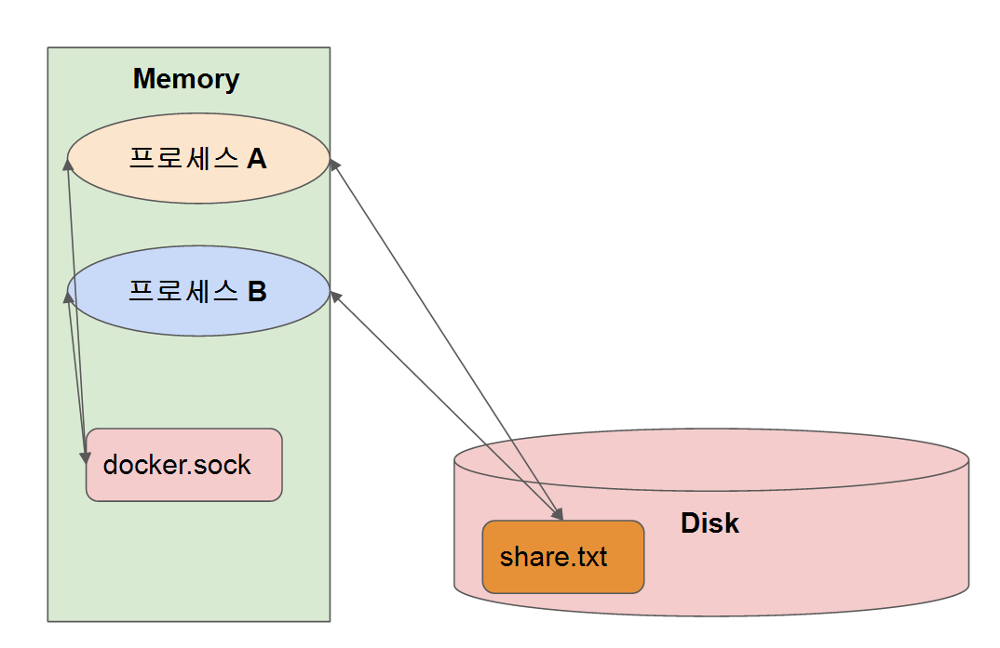

# 도커 구조 (dockerd / containerd / runc)

```
이 구조를 왜 알아야 하는가?
문제 해결도 해야되는데 원래 구조에 대한 이해를 해야 더 좋다. 
```


```
runc는 계속 구동되는게 아니라 생성할 떄만 쓰고 끝난다.

containerd 밑에 container-shim 이 있는게 무엇인가?
container-shim 이 없으면 container 가 정상적으로 작동이 되었는지 비정상 종료가
되었는지 알기 어렵게 됨. 그런걸 관리하기 위한 프로세스임.

sock 파일 -> 메모리 상에 존재하는 특수 파일. 프로세스간 통신을 위한 파일

docker 명령어가 docker 그 자체는 아님 껍데기 -> cli로 명령어를 전달 하는 도구임
명령어를 받는 엔진은 dockerd임

컨테이너 안에 dockerd를 하나 더 만드는것은 지향함. 
컨테이너 안의 dockerd로 밖의 dockerd를 공유를 해 컨트롤 할 수 있게 만들 수는 있음.
```



```
소켓 파일 구조
disk에 적고 disk내용을 공유하기에 느림. 그러나 정확한 내용을 전달가능함. 

sock 파일 -> 메모리 상에 존재하는 특수 파일. 프로세스간 통신을 위한 파일

가끔 오류가 발생 할 때가 있다. 호스트가 docker 명령어를 칠 때 발생하는 걸로
소켓파일에 permission denied 나 소켓파일이 없을 때
```

## 실습

```bash
# docker 엔진과 docker CLI 툴 확인     
$ dpkg -l | grep docker

# docker 엔진 (데몬 확인하기)
$ sudo service docker status
$ ps -ef | grep dockerd

# containerd 와 containerd-shim 확인하기  
$ sudo service containerd status
$ ps -ef | grep containerd

# docker 엔진과 연결되는 sock 파일 확인하기
# /var/run/docker.sock
$ sudo lsof | grep docker.sock

# 호스트의 /var/run/docker.sock 을 컨테이너 내부로 연결해서 컨테이너 실행
$ docker run -it -v /var/run/docker.sock:/var/run/docker.sock ubuntu:16.04 /bin/bash  

# 컨테이너 내부에서 docker 설치하고 테스트
$ apt update && apt install docker.io 
$ docker -v
$ docker ps
```