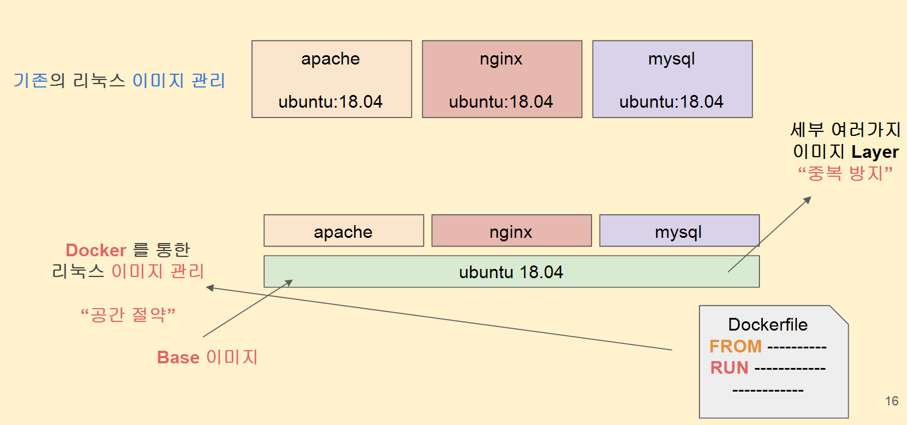
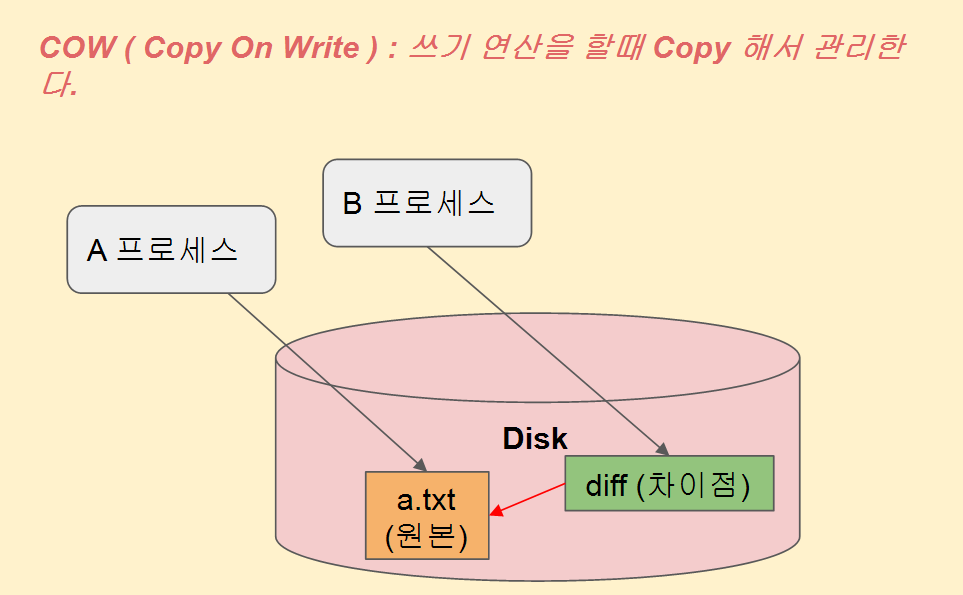
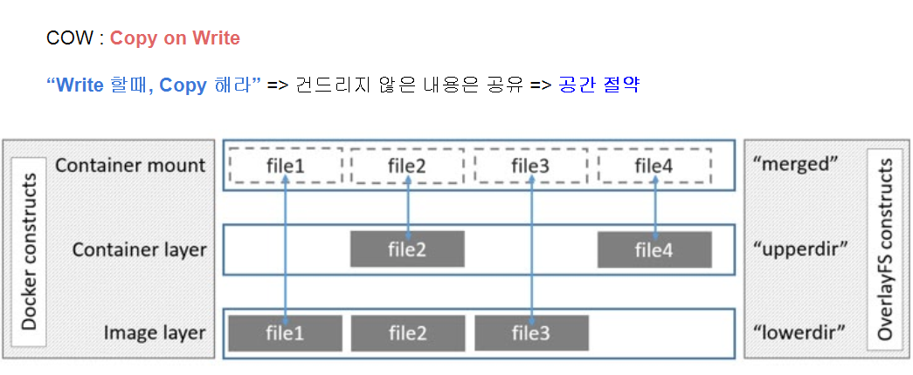

# 도커 이미지 관리 (Docker Image Layer)

```
docker file 에서 from 에 적히는 내용은 base image가 적히게 된다. 

공통된 부분의 layer는 공유하고 달라진 점에 대한 관리는 cow(copy on write)를 이용하여 따로 관리
그래서 공간낭비가 줄어들게 된다.

ubuntu:16.04 는 하나의 통 이미지로 구성이 된게 아니라 여러가지의 layer로 이루어져 있음. 
```





```bash
# 현재 가지고 있는 이미지 히스토리 확인하기
$ docker images
$ docker history ubuntu:16.04

# 컨테이너 루트 파일시스템와 이미지의 관리하는 폴더 확인하기  
$ docker inspect 2928a0dc642c | grep overlay2
$ ls /var/lib/docker/overlay2/

# 마운트 정보로 컨테이너 루트파일시스템 확인하기
# LowerDir: 원본이미지 내용 (여러개의 layer 로 구성)
# MergedDir: 원본이미지(Lower)와 달라진점(diff)의 합쳐진 실제 컨테이너 루트파일시스템   
# UpperDir: 컨테이너상에서 사용하는 달라진점(diff)
# WorkDir: overlay2에서 내부적으로 쓰는 폴더
$ mount | grep overlay
```


