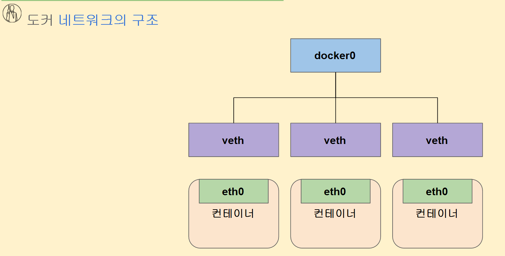

# 도커 네트워크 이해

```
네트워크 bridge 란?
2개이상의 네트워크를 L2 레벨로 연결하여 1개의 싱글 LAN(docker0) 으로 통신

veth 란?
Pair 가상 네트워크 인터페이스 (두개의 namespace 를연결)

docker0 = bridge 
```



# 실습 결과

```bash
reallinux@project:~$ docker network ls
NETWORK ID     NAME      DRIVER    SCOPE
2f19c851c6ee   bridge    bridge    local
a9e8795f6dfd   host      host      local
87d23f477415   none      null      local

# 여기서 host를 그대로 쓰게 되면 다른 container를 쓸 수 없게 된다. 보통 bridge를 써서 여러개의 container를 쓰는
reallinux@project:~$ brctl show
bridge name     bridge id               STP enabled     interfaces
docker0         8000.6a14a8777448       no              veth20a8c14
                                                        vethe0829ac
                                                        vethed91fbe
# 이게 지금 bridge를 통해 3개의 container가 실행된 모습

#container 내부에서는 route -n 
root@8f407c2e9a2b:/# route -n
Kernel IP routing table
Destination     Gateway         Genmask         Flags Metric Ref    Use Iface
0.0.0.0         172.17.0.1      0.0.0.0         UG    0      0        0 eth0
172.17.0.0      0.0.0.0         255.255.0.0     U     0      0        0 eth0

#container 내부의 default gateway는 docker0 브리지의 IP 주소이며,
#container는 외부 네트워크로 나가기 위해 docker0을 gateway로 사용한다.
 
# 호스트 상에서 ip addr show 결과 중 하나
3: docker0: <BROADCAST,MULTICAST,UP,LOWER_UP> mtu 1500 qdisc noqueue state UP group default
    link/ether 6a:14:a8:77:74:48 brd ff:ff:ff:ff:ff:ff
    inet 172.17.0.1/16 brd 172.17.255.255 scope global docker0

```

## 실습

```bash
# 브릿지 네트워크 관리 도구 설치 및 확인
$ sudo apt install bridge-utils
$ whatis brctl
brctl (8)            - ethernet bridge administration

# 현재 브릿지 네트워크 상태 확인
$ brctl show

# 컨테이너(독립된 리눅스 환경) 3개실행하기
$ docker run -it -d ubuntu:16.04
$ docker run -it -d ubuntu:16.04
$ docker run -it -d ubuntu:16.04

# 현재 브릿지 네트워크 상태 확인
$ brctl show
bridge name     bridge id               STP enabled     interfaces
docker0         8000.02422e7e41ca       no              veth0a53b32
                                                        veth818aa48
                                                        veth94c1c7e  
# 현재 호스트 기준으로 네트워크 인터페이스 확인하기
$ ip link

# 현재 구동중인 container 확인하기
$ docker ps
CONTAINER ID   IMAGE          COMMAND       CREATED            NAMES
455029e9c283   ubuntu:16.04   "/bin/bash"   ...                test2
6ed53f2da0a1   ubuntu:16.04   "/bin/bash"   ...                test1
261aae3c25dd   ubuntu:16.04   "/bin/bash"   ...                hungry_lehmann
2097d08252b7   ubuntu:16.04   "/bin/bash"   ...                xenodochial_einstein 
853061e63da3   ubuntu:16.04   "/bin/bash"   ...                peaceful_elbakyan

# 특정 컨테이너로 접속(명령어 반응형 프로그램 bash 컨테이너 내 자식프로세스로 실행)
$ docker exec -it [컨테이너 ID] bash
$ apt update && apt install -y net-tools
$ route -n
Kernel IP routing table
Destination     Gateway         Genmask         Flags Metric Ref    Use Iface
0.0.0.0         172.17.0.1      0.0.0.0         UG    0      0        0 eth0
172.17.0.0      0.0.0.0         255.255.0.0     U     0      0        0 eth0
$ exit
exit

$ ip addr | grep -A 2 docker0:
3: docker0: <BROADCAST,MULTICAST,UP,LOWER_UP> mtu 1500 qdisc noqueue state UP group default 
    link/ether 02:42:04:36:72:99 brd ff:ff:ff:ff:ff:ff
    inet 172.17.0.1/16 brd 172.17.255.255 scope global docker0
    
    
# 전체 컨테이너 기준 Network IP Address 확인하기
reallinux@project:~$ docker inspect $(docker ps -q) | grep -e "IPAddress\|Id"
        "Id": "8f407c2e9a2b9d9d6c5a89a74641d95bdebc7cb06e28598c137ee62b182cb5e2",
                    "IPAddress": "172.17.0.4",
        "Id": "6a28e596819e6ef7238dd66c2f2f12f30843e7e2bf1a97ac70b161b7dd0d44d7",
                    "IPAddress": "172.17.0.3",
        "Id": "115d73223cafc924bacdc5d2a5b1de48b559924328b6e37f7cc27d927efbe3a7",
                    "IPAddress": "172.17.0.2",

```