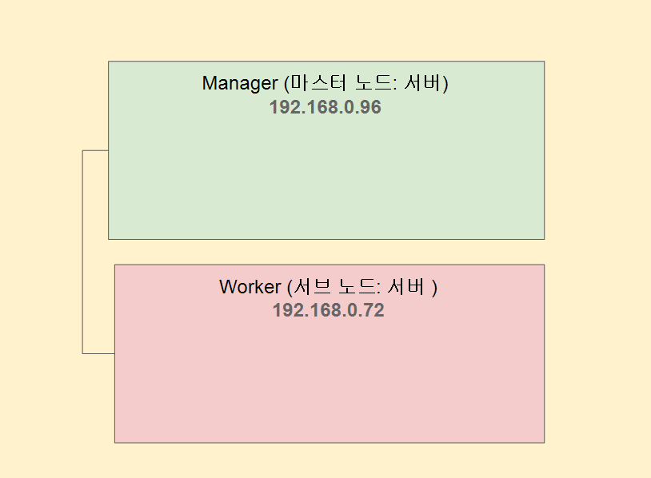
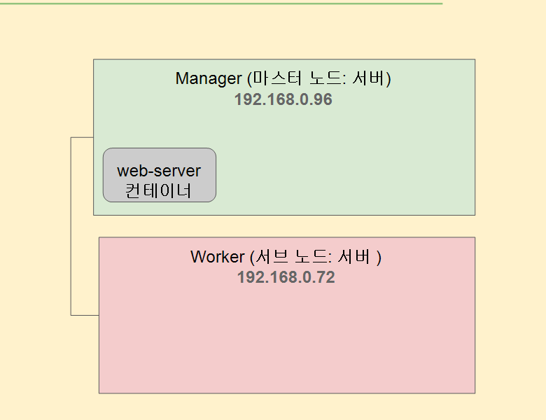
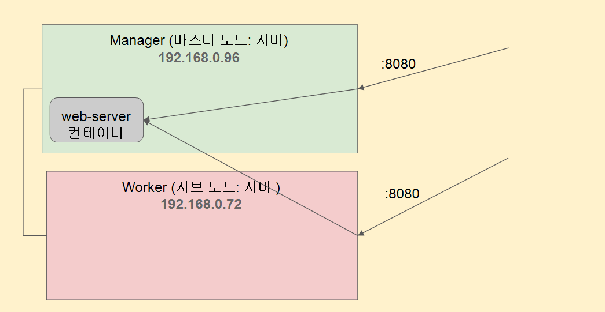
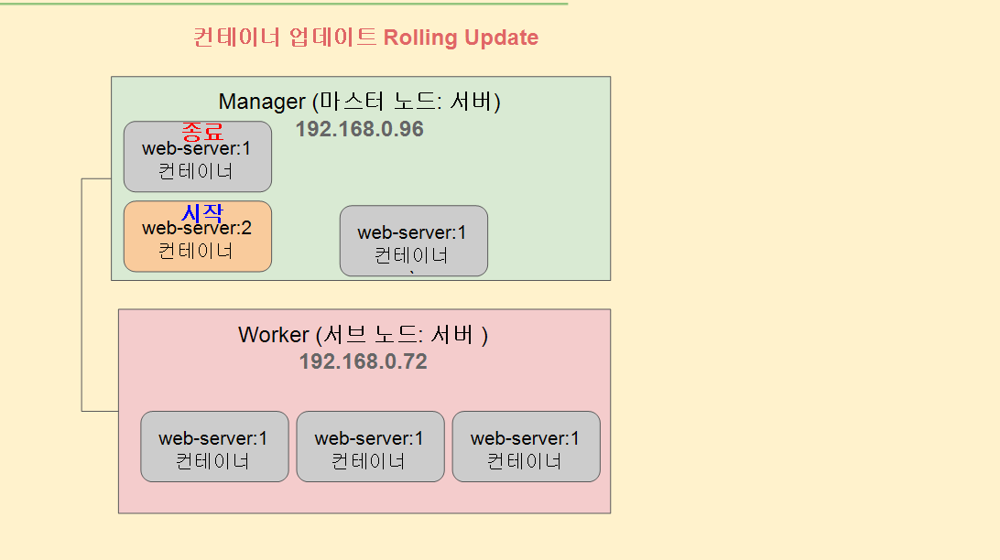
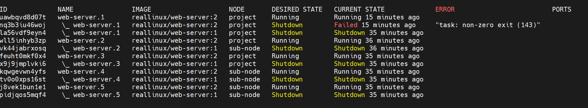
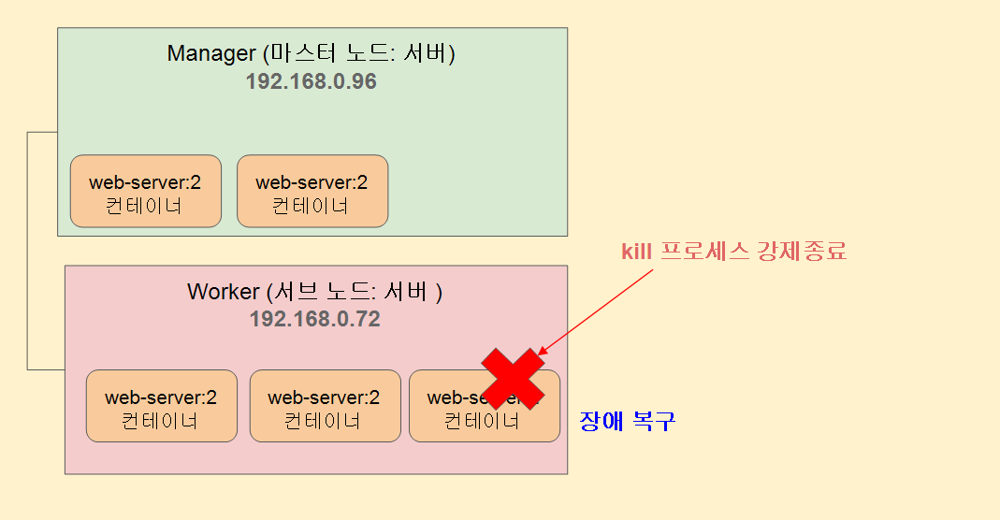

# Docker Swarm 을 통한 오케스트레이션 기능 실습

```bash
# 현재 마스터 노드(서버)로 사용할 서버의 IP 주소가
# 192.168.0.96 이라고 가정하고 진행
# 본인의 서버 IP 주소 확인 (ip address 명령어)
$ docker swarm init --advertise-addr 192.168.20.69  

# 서브노드(work) 등록을 위한 join token 정보 재확인 방법
$ docker swarm join-token worker

# 참고: swarm 설정 종료
$ docker swarm leave --force

# 마스터(manager) 노드 IP 주소 포트에 맞게 서브(worker)노드로 추가
$ docker swarm join --token SWMTKN-1-1de9bqshtlsn77kkzq33vok4dh7c4zul31kznk4xwqgrtjgnkv-6lu1o3e9vm1jj5ljchisa78ul 192.168.20.69:2377

# 이 과정을 할 때 ufw 켜져있는지 확인하기 켜져 있으면 제대로 안됨

# 마스터(manager) 노드에서 노드정보 확인 
$ docker node ls

```




```bash
# DockerHub 에서 reallinux/web-server:1 (버전 1)이미지 받아서
# nodejs http web-server 컨테이너 실행하기
$ docker service create --name web-server -p 8080:80 reallinux/web-server:1

# 참고: service 컨테이너들 확인
$ docker service ps web-server

# 참고: (주의) service 삭제 방법
$ docker service rm web-server

# 실행한 web-server(node 웹서버) 컨테이너 확인하기
$ docker service ls

# 실행한 web-server(node 웹서버) 컨테이너 세부정보 확인하기
$ docekr service ps web-server

# 실제 default 컨테이너 프로세스(node) 확인하기
# (1) web-server 이미지 ID 확인하기
$ docker images
# (2) web-server 이미지 내부의 Cmd(기본 프로세스) 확인
$ docker inspect d3c975fa44a2 | grep node
                "CMD [\"/bin/sh\" \"-c\" \"node --port 80\"]"               "node --port 80"
                
# 마스터 노드 기준: web-server 웹서버 http 요청 테스트 
$ curl 192.168.20.69:8080
# 서브 노드 기준: web-server 웹서버 http 요청 테스트
$ curl 192.168.20.75:8080
```





```bash
# web-server 웹서버 복제(Replicas) 만들기 
$ docker service scale web-server=5

# 복제 확인하기
$ docker service ps web-server

# curl 테스트로 여러개의 컨테이너로
# 로드밸런싱 되고있음을 확인하자
$ curl ubuntu:8080
$ curl ubuntu:8080
$ curl ubuntu:8080
$ curl ubuntu:8080
$ curl ubuntu:8080
$ curl ubuntu:8080
...

# web-server 웹서버 버전 업데이트
# 버전 1 => 버전 2
$ docker service update --image reallinux/web-server:2 web-server  
  
# 빠르게 추가 (마스터 노드) 터미널에서 상태 1초주기로
# Rolling update 확인하기
$ watch -n 1 docker service ps web-server
```




**Rolling update**는

> 서비스를 멈추지 않고(무중단으로) 컨테이너를 하나씩 새 버전으로 교체하는 배포 방식이야.
> 

```bash
# 현재 실행중인 web-server 컨테이너 프로세스 ID 확인
$ docker inspect 348f851286fe | grep Pid
            "Pid": 25053,
            "PidMode": "",
            "PidsLimit": null,

# 강제 종료
$ sudo kill -9 25053

# 빠르게 추가 (마스터 노드) 터미널에서 상태 1초주기로 확인하기
$ watch -n 1 docker service ps web-server

종료되어도 알아서 복구 되는 모습을 볼 수 있다. 
Swarm은 “컨테이너”를 관리하지 않고 “원하는 상태(desired state)”를 관리한다. 
```



