# 쿠버네티스 이해와 구조

## k8s 용어

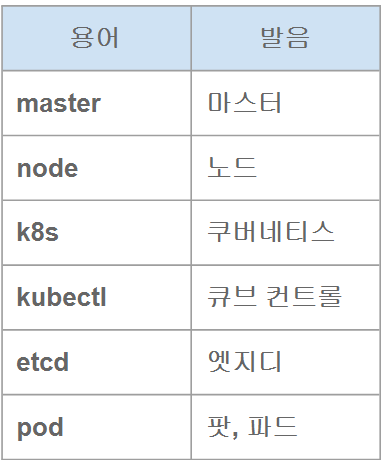

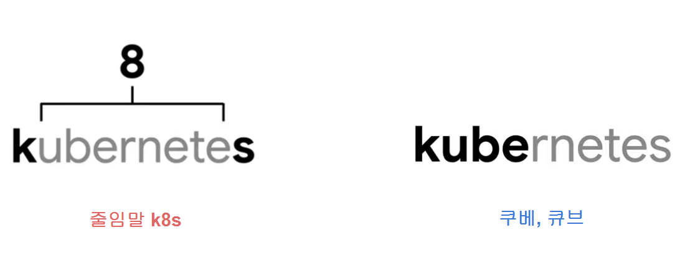

---

# 쿠버네티스 아키텍처 구조

```
간단한 시나리오 : container를 실행시킨다

실행시킬 명령어는 kubectl 을 통해서 실행시키게 된다. -> API server에게 container를 실행해줘라고 하게됨 (restful api를 통해)
그 후 어디에 실행하게 될지 결정해야됨. 
schedular : pod(container)가 어느 서버에 물리적으로 실행될지 결정하는 역할 

서버들이 다 똑같고 하드웨어적인 특성이 없다면 어떻게 스케줄링 할 것인가? -> pod에 대한 갯수를 동등하게 분배한다.

etcd는 모든 동작과정들을 기록하는 역할을 한다. (schedular 동작과정, 외부의 명령 등 모든 동작을 기록)

controller manager는 클러스터의 상태를 지속적으로 감시하면서, 사용자가 요청한 원하는 상태(desired state) 와
현재 클러스터의 실제 상태(current state) 를 비교한다.
예를 들어, 실행 중이어야 할 Pod의 개수가 줄어들면 Pod를 다시 생성

proxy 는 k8s 에서 내부 네트워크 부분을 담당 
```

## **컨트롤 패널 (master): etcd**

**k8s 모든 동작과정 상태 / 로그 데이터 저장**

 ****분산시스템으로 안정성 확보

key-value 형태로 데이터 저장

 kubectl get events 를 통한 쿠버네티스 각종 이벤트 확인가능

## **컨트롤 패널 (master): API 서버**

**k8s 관리 / 제어를 위한 REST API 서버**

kubectl 명령어 등을 통해서 API 서버 호출

etcd를 통해서 세부 제어 / 동작 과정 로그데이터 저장

권한 점검 및 제어 / 내부 모듈과의 통신 제어

## **Kubelet: pod(컨테이너) 생성 역할**

**Pod 실행 / 종료 역할**

Pod 상태 확인 역할

전체 서버(node) 마다 구동

CRI(Container Runtime Interface): docker, containerd, CRI-O 등

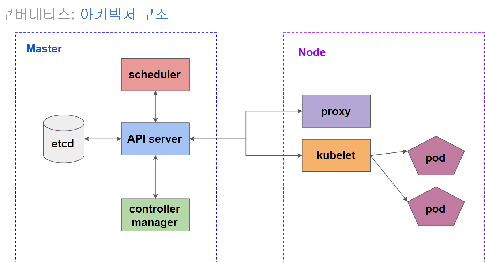

## **컨트롤 패널 (master): 스케줄러(Scheduler)**

새롭게 생성되는 pod 가

**어느 서버(Node)에서 실행 될지**를 결정 내림

다양한 라벨 설정을 통해서 설정가능

(예: GPU 중심적인 서버 전용 pod )

## **컨트롤 패널 (master): 컨트롤러(Controller)**

k8s 자동 관리 / 상태 유지를 위한 다양한 컨트롤러가 존재

복제 컨트롤러, 노드 컨트롤러 등

**지속적인 상태 체크 / 설정된 상태 유지 작업**

## **Kube-Proxy: 쿠버네티스 내부 네트워크 처리**

pod, service 등 **k8s 내부 네트워크 처리**

네트워크 프록시와 부하 분산 역할

user space / iptables / IPVS 모드로 사용가능

---

```
아키텍처 구조 = “쿠버네티스가 어떻게 동작하는가(엔진 구조)”
오브젝트 구성 = “쿠버네티스가 무엇을 관리하는가(관리 대상)”

일반적으로 1컨테이너 1앱 1파드 로 구성된다. 
```

# 쿠버네티스 오브젝트 구성


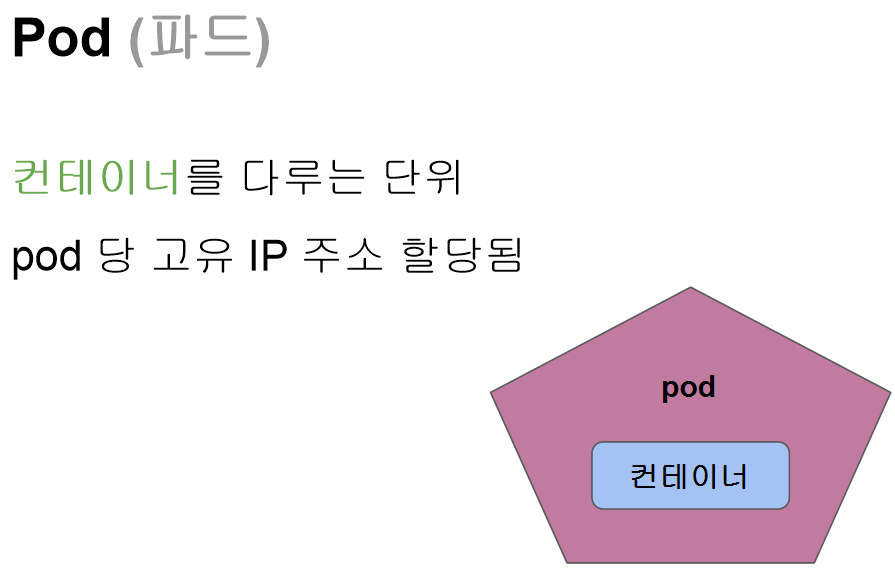

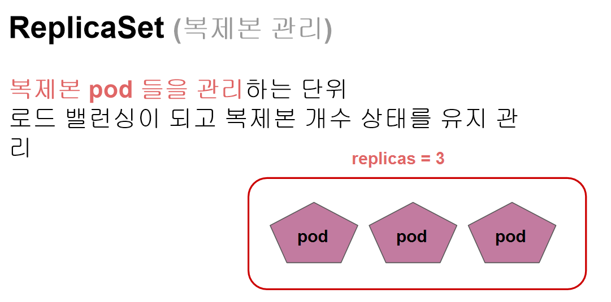

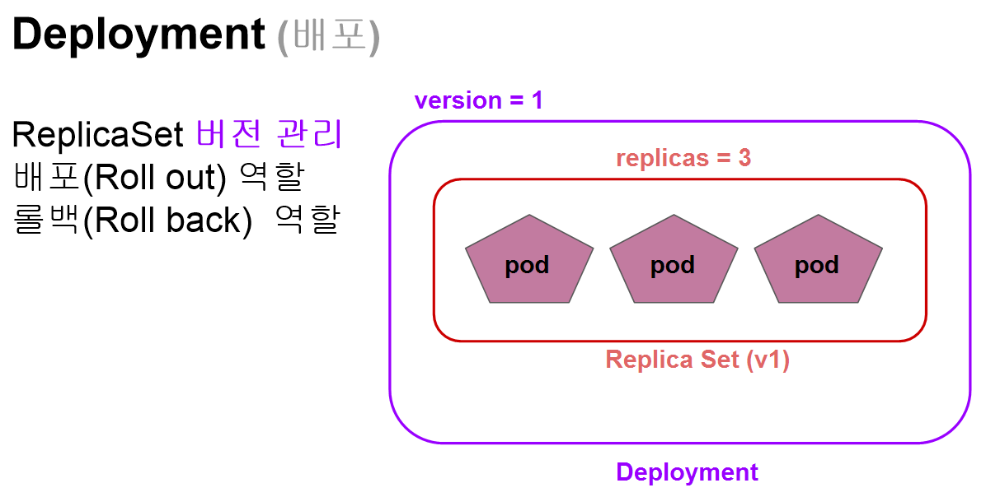

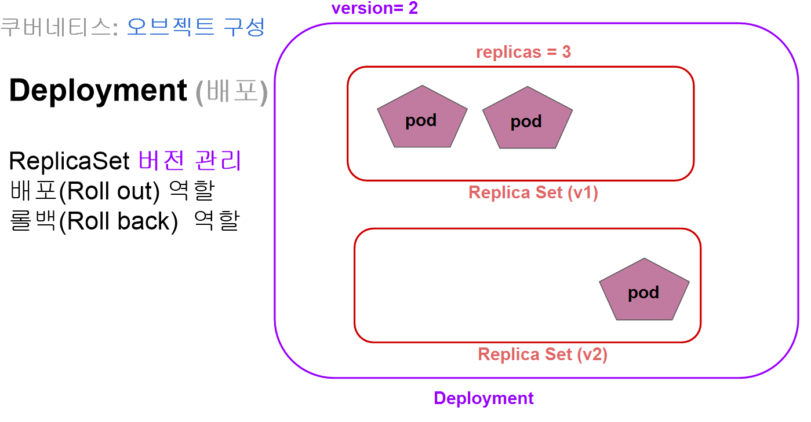

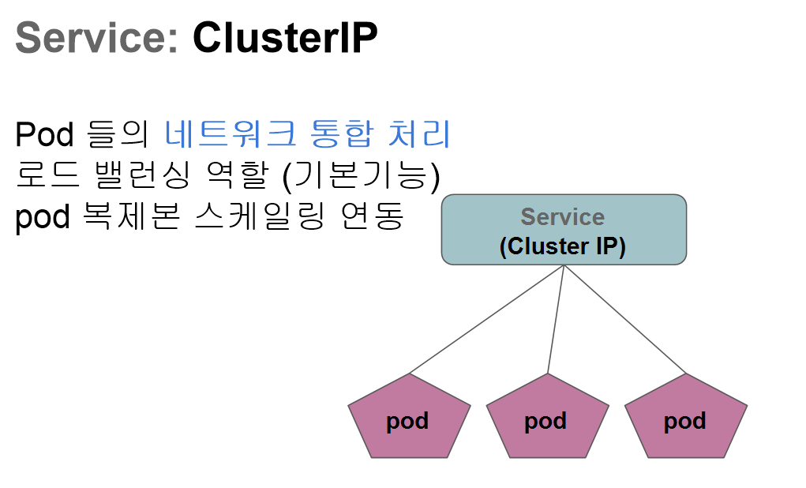

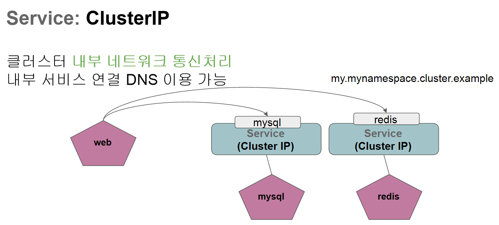

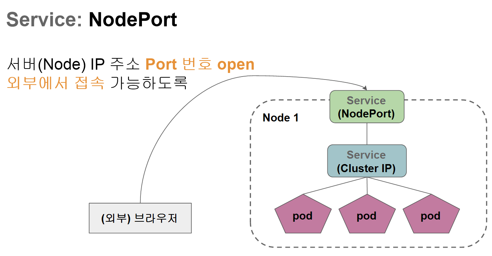

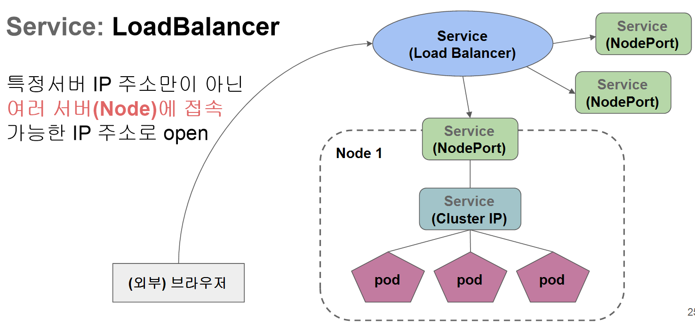

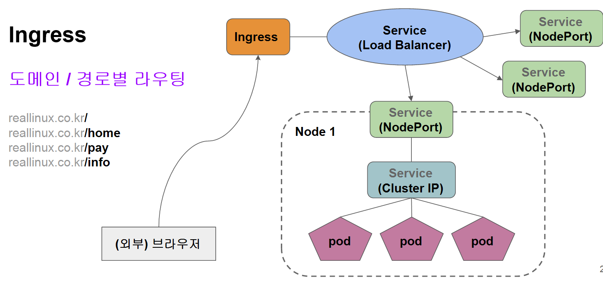

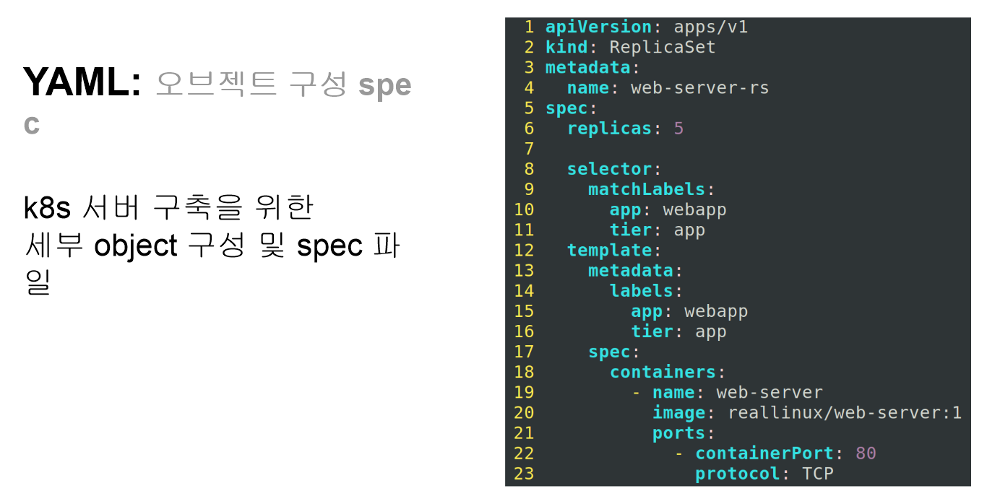


## 아키텍처 구조랑 오브젝트 구정에 대해서 궁금해서 물어본 gpt 답

## 차이를 표로 정리하면

| 구분 | 아키텍처 구조 | 오브젝트 구성 |
| --- | --- | --- |
| 핵심 질문 | 어떻게 동작하는가? | 무엇을 관리하는가? |
| 대상 | 쿠버네티스 내부 컴포넌트 | 쿠버네티스가 관리하는 리소스 |
| 예시 | API Server, Scheduler | Pod, Deployment, Service |
| 성격 | 시스템 구조 | 논리적 리소스 |
| 사용자 | 보통 잘 안 만짐 | 사용자가 직접 생성/정의 |

---

## 둘의 관계를 연결하면 (중요)

> 오브젝트(Pod, Deployment 등)를 만들면 →
아키텍처 컴포넌트들이 협력해서 그 오브젝트를 실제로 실행·유지한다
>