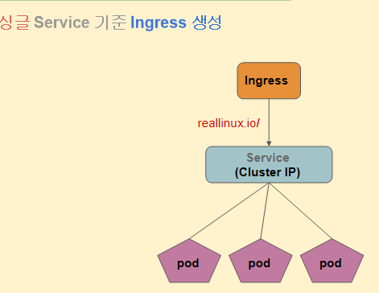
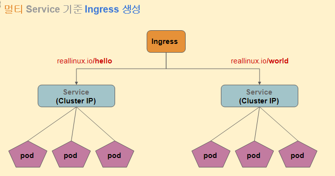

# 쿠버네티스 Ingress: Light-weigt API Gateway

```bash
Ingress는 쿠버네티스에서 외부 HTTP/HTTPS 요청을 단일 진입점으로 받아,
도메인이나 URL 경로 기준으로 내부 Service로 라우팅하는 L7 리소스이다.
```

## Ingress와 Service의 차이 (핵심 비교)

| 구분 | Service | Ingress |
| --- | --- | --- |
| 계층 | L4 (TCP) | L7 (HTTP) |
| 기준 | IP + Port | Host / Path |
| 대상 | Pod | Service |
| 역할 | 내부 연결 | 외부 진입점 |

---

## **싱글 Service 기준 Ingress 생성**



```bash
$ kubectl get ingress
$ kubectl describe ingress

# 접속 테스트
$ curl reallinux.io

# 종료
$ kubectl delete -f web-server-ingress.yaml

```

```
curl reallinux.io
   ↓
/etc/hosts (192.168.10.7)
   ↓
Ingress (도메인 규칙)
   ↓
Service
   ↓
Pod (웹 서버)

결론
이 실습은
“Ingress가 외부 요청을 받아서
내부 서비스로 연결해주는 역할”을
로컬 환경에서 체험해보는 구성이야.
```

```bash
# 로컬 도메인 명칭 만들기
# 예시 node IP: 192.168.10.7
$ sudo vim /etc/hosts
...
192.168.10.7 reallinux.io
```

### YAML 파일

```yaml
apiVersion: apps/v1
kind: Deployment
metadata:
  name: web-server-rs
spec:
  replicas: 5
  selector:
    matchLabels:
      app: webapp
      tier: app
  template:
    metadata:
      labels:
        app: webapp
        tier: app
    spec:
      containers:
        - name: web-server
          image: reallinux/web-server:2
          ports:
            - containerPort: 80
              protocol: TCP
---
apiVersion: v1
kind: Service
metadata:
  name: web-server
spec:
  type: NodePort
  ports:
    - port: 8080
      targetPort: 80
      protocol: TCP
      nodePort: 31000
  selector:
      app: webapp
      tier: app

---
apiVersion: networking.k8s.io/v1
kind: Ingress
metadata:
  name: test-ingress
  annotations:
    kubernetes.io/ingress.class: traefik
spec:
  rules:
    - host: reallinux.io
      http:
        paths:
          - path: /
            pathType: Prefix
            backend:
              service:
                name: web-server
                port:
                  number: 8080

```

---

## **멀티 Service 기준 Ingress 생성**



```bash
# 생성
kubectl apply -f web-server-ingress2.yaml

#테스트
curl reallinux.io/hello
curl reallinux.io/world
```

### 요청 1

```bash
curl reallinux.io/hello
```

흐름:

```
Ingress →web-server-1(Service) → web-server:2 파드 중 하나
```

---

### 요청 2

```bash
curl reallinux.io/world
```

흐름:

```
Ingress →web-server-2(Service) → web-server:3 파드 중 하나
```

### YAML 파일

```yaml
apiVersion: apps/v1
kind: Deployment
metadata:
  name: web-server-rs-1
spec:
  replicas: 5
  selector:
    matchLabels:
      app: webapp-1
      tier: app-1
  template:
    metadata:
      labels:
        app: webapp-1
        tier: app-1
    spec:
      containers:
        - name: web-server
          image: reallinux/web-server:2
          ports:
            - containerPort: 80
              protocol: TCP

---
apiVersion: v1
kind: Service
metadata:
  name: web-server-1
spec:
  type: ClusterIP
  ports:
    - port: 8080
      targetPort: 80
      protocol: TCP
  selector:
      app: webapp-1
      tier: app-1

---

apiVersion: apps/v1
kind: Deployment
metadata:
  name: web-server-rs-2
spec:
  replicas: 5
  selector:
    matchLabels:
      app: webapp-2
      tier: app-2
  template:
    metadata:
      labels:
        app: webapp-2
        tier: app-2
    spec:
      containers:
        - name: web-server
          image: reallinux/web-server:3
          ports:
            - containerPort: 80
              protocol: TCP
---
apiVersion: v1
kind: Service
metadata:
  name: web-server-2
spec:
  type: ClusterIP
  ports:
    - port: 8080
      targetPort: 80
      protocol: TCP
  selector:
      app: webapp-2
      tier: app-2

---
apiVersion: networking.k8s.io/v1
kind: Ingress
metadata:
  name: test-ingress
  annotations:
    kubernetes.io/ingress.class: traefik
spec:
  rules:
    - host: reallinux.io
      http:
        paths:
          - path: /hello
            pathType: Prefix
            backend:
              service:
                name: web-server-1
                port:
                  number: 8080
          - path: /world
            pathType: Prefix
            backend:
              service:
                name: web-server-2
                port:
                  number: 8080

```

---

## **Global Domain 기준 Ingress 테스트**

```bash
# yaml 파일 수정하기
# 예시 도메인 : 192-168-0-212.nip.io
$ kubectl delete -f web-server-ingress2.yaml
$ vim web-server-ingress.yaml
$ cat web-server-ingress.yaml
...
kind: Ingress
metadata:
  name: test-ingress
  annotations:
    kubernetes.io/ingress.class: traefik
spec:
  rules:
    - host: 192-168-0-212.nip.io

...

# 오브젝트 스펙 yaml 적용하기
$ kubectl apply -f web-server-ingress.yaml

# (참고용) 오브젝트 스팩 yaml 기준으로 삭제하기 
$ kubectl delete -f web-server-ingress.yaml

# ingress 정보 확인하기
$ kubectl describe ingress

# 웹 요청 테스트
$ curl 192-168-0-212.nip.io

# 오브젝트 스팩 yaml 기준으로 삭제하기 
$ kubectl delete -f web-server-ingress.yaml

```